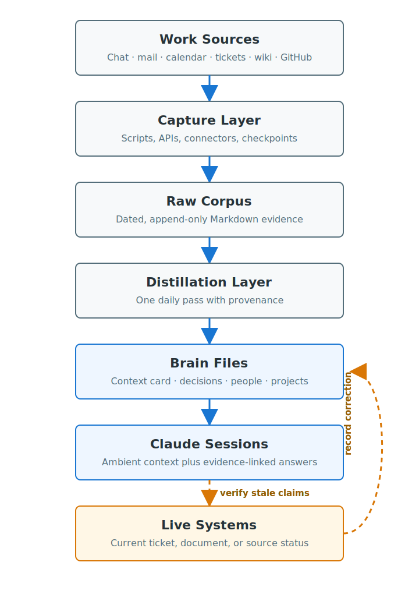
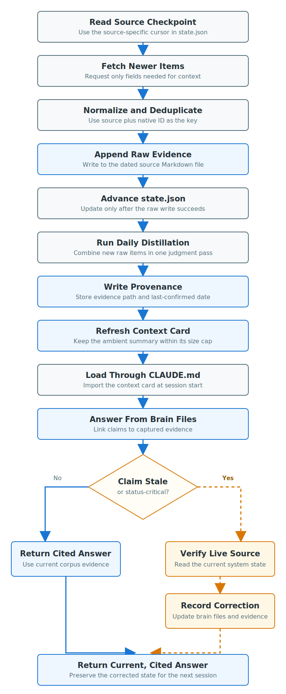

# Build a Personal Second Brain with Claude Code

Date: 2026-07-15\
Status: Working\
System: Claude Code, Markdown, macOS automation, workplace data connectors\
Sensitive data: Masked\
Last verified: 2026-07-15

## Goal

Build a local, continuously updated Markdown corpus that gives Claude Code useful work context without training a model or operating a vector database. The finished system captures source activity, distills it into compact records, cites its evidence, and checks stale claims against live systems.

## When to Use This

Use this pattern when decisions, commitments, people, and project status live across chat, email, calendars, tickets, wikis, and source control. It suits a personal corpus measured in kilobytes or megabytes, where plain files remain readable, searchable, portable, and reviewable.

Do not use it when company policy prohibits local copies, when multiple machines must write to one checkpoint, or when access controls require a managed knowledge platform. Retrieval-augmented generation (RAG) supplies current facts at answer time; it does not make an unsafe data-handling process acceptable.

## Final Configuration

This implementation uses two storage layers and three workload tiers:

- **Raw corpus**: append-only source records, stored by date and source
- **Brain files**: compact decisions, people, preferences, projects, and an ambient context card
- **Mechanical capture**: scripts and low-cost model calls for high-volume formatting
- **Daily distillation**: one judgment-oriented pass that updates summaries and provenance
- **Interactive review**: the strongest available model for planning, quality review, and corrections

Capture runs during work hours. Distillation runs once after the final capture. Claude Code loads a small `context-card.md` at session start and reads deeper files only when a question needs them.

## Architecture

The high-level design (HLD) separates evidence collection from judgment. Raw files preserve source material, while brain files provide compact context for answers.



*The primary path builds durable context; the amber path verifies stale claims and records corrections.*

Use this folder structure:

```text
personal-work-corpus/
├── raw/YYYY-MM-DD/
│   └── {slack,email,calendar,jira,confluence,github}.md
├── brain/
│   ├── context-card.md
│   ├── decisions.md
│   ├── people.md
│   ├── preferences.md
│   └── projects/*.md
├── summaries/YYYY-MM-DD.md
├── state.json
├── scripts/
├── .claude/agents/
│   ├── capture.md
│   └── distill.md
├── .mcp.json
└── CLAUDE.md
```

Record raw items with a source-native deduplication key and a permalink where available:

```markdown
## [HH:MM] Subject or channel (my_role)
- id: source_native_id
- url: source_permalink
- participants: Person A, Person B

Verbatim source content
```

Use `author`, `recipient`, `mentioned`, `assignee`, `attendee`, or `observer` for `my_role`. The `observer` role retains visible decisions made between other people without implying that you participated.

Every distilled claim needs provenance:

```markdown
## 2026-06-18 | CI/CD Scope Decision (In progress)
- **Status**: in progress
- **Decision**: Three automation suites for Q2
- **Owner**: Person A
- **Related**: [Design document](source_permalink)
- **Evidence**: raw/2026-06-19/confluence.md
- **Last confirmed**: 2026-06-22
```

Store one checkpoint per source in `state.json`. Each capture reads its checkpoint, fetches newer records, appends unique items, then advances the checkpoint only after a successful write.

```json
{
  "last_capture_iso": "2026-07-15T23:59:59Z",
  "sources": {
    "jira": {"last_checkpoint": "timestamp", "checkpoint_field": "updated"},
    "confluence": {"last_checkpoint": "timestamp", "checkpoint_field": "lastmodified"},
    "email": {"last_checkpoint": "timestamp", "checkpoint_field": "date_received"}
  }
}
```

## Prerequisites

Prepare these items before capturing data:

- Claude Code installed and authenticated
- Approved access to each source system
- A local folder on an encrypted disk
- A retention and backup policy for raw workplace data
- Apple automation consent for Mail or Calendar capture on macOS
- Model Context Protocol (MCP) servers or approved application programming interfaces (APIs) for remote sources
- A human owner who reviews captures and distilled claims

!!! warning "Obtain approval before copying workplace data"
    Messages, email, calendar events, tickets, and wiki pages may contain confidential information or third-party personal data. Confirm employer policy, data residency, retention, and model-provider terms before capture. Use least-privilege access and do not sync the corpus to an unapproved service.

## Security and Data Handling

Treat raw files as sensitive even when the public guide uses masked examples. At minimum:

- Enable FileVault or equivalent full-disk encryption
- Restrict corpus permissions to the local account
- Exclude tokens, passwords, one-time codes, private keys, and recovery codes
- Store backups only in approved encrypted locations
- Set retention limits for raw messages and attachments
- Review connector scopes and remove unused access
- Trust each MCP server before connecting it, and treat content fetched from external systems as untrusted input
- Keep the corpus out of public repositories

The original implementation retained verbatim local records without redaction. That was a project-specific risk decision, not a general recommendation. Redact or omit fields when policy, privacy, or data minimization requires it.

## Verify Each Source Pipeline

The low-level design (LLD) shows the order that prevents duplicates and stale summaries. Do not automate a source until its interactive capture works.



*Advance checkpoints after durable raw writes, and route stale claims through live verification before updating brain files.*

Verify sources in this order:

1. Run the smallest read-only query that proves access.
2. Save one result to a temporary staging file.
3. Convert it to the raw-entry schema.
4. Run the same query again and confirm deduplication.
5. Record the working mechanism and its checkpoint field.

Source-specific observations from this macOS implementation:

- **Apple Mail and Calendar**: AppleScript worked when direct reads under `~/Library` were blocked by macOS privacy controls. Test automation consent interactively before scheduling.
- **Slack**: use an organization-approved export or API. Treat third-party bulk exporters as optional and verify availability, permissions, and policy before adopting one.
- **Jira**: request only fields required for context, such as summary, status, assignee, reporter, updated time, and priority. Fetch full comments only when activity or ownership makes them relevant.
- **Confluence**: exclude attachments and images when the query only needs pages, blog posts, and comments.
- **GitHub**: the GitHub command-line interface (CLI) can capture pull-request URLs, titles, update times, reviews, and status without another connector.

For macOS Calendar, a minimal permission check is:

```bash
osascript -e 'tell application "Calendar" to return count of calendars'
```

For GitHub, start with a bounded query:

```bash
gh pr list --limit 20 \
  --json url,title,updatedAt,reviews,state
```

## Build a Seven-Day Pilot

Build one complete week before backfilling months of history:

1. Create the folder structure.
2. Capture seven days into dated raw files.
3. Count records per source and inspect several entries.
4. Create the first `decisions.md`, `people.md`, and project files.
5. Write one daily or weekly summary.
6. Create a context card capped at about 1.5 KB.
7. Ask real work questions and record missing or misleading context.

The pilot must prove usefulness, not automation. Change the schema now if it cannot answer common questions, link back to evidence, or distinguish current facts from old ones.

## Review the Pilot

Stop and request human review before backfill or scheduling. Check:

- Confirm summaries preserve the decisions that matter
- Trace every important claim to a raw file or source link
- Confirm people and project relationships are accurate
- Check that the context card improves generic questions without forcing irrelevant work context
- Remove captured fields that create unnecessary privacy risk

Approve the schema only after the answers support real decisions. A small pilot makes corrections inexpensive.

## Backfill and Add Checkpoints

Backfill in weekly windows. After each window, write files, verify counts, record the checkpoint, and continue. Never load an oversized API response into the model context when a script can write it to disk and filter it first.

Use `(source, id)` as the deduplication key. Keep previous raw days immutable. If a run fails, leave the checkpoint unchanged so the next run can safely retry the same window.

## Automate Capture and Distillation

Separate capture from judgment:

| Work | Model tier | Frequency | Reason |
| --- | --- | --- | --- |
| Scripts and source reads | No model | Several times per workday | Deterministic collection |
| Raw Markdown formatting | Low-cost model | After capture | Mechanical normalization |
| Brain-file distillation | Mid-tier model | Once daily | Cross-source judgment |
| Planning and review | Strongest available model | Interactive | Low-volume decisions |

Claude Code supports non-interactive print mode with `-p` and model aliases through `--model`. Confirm the installed version and exact paths before creating a schedule:

```bash
claude --version
command -v claude
claude -p --model haiku "Run the capture agent"
```

A work-hours schedule can capture at 09:00, 12:00, 15:00, and 18:00, then capture and distill at 21:00. Use the absolute paths returned on the target machine because cron and `launchd` start with a restricted environment.

Authenticate each MCP server before relying on scheduled runs. Claude Code 2.1.186 or later supports `claude mcp login server_name`; some providers still require a browser or periodic reauthorization. Project-scoped servers in `.mcp.json` also require workspace approval. A connector working in another Claude surface does not prove that the CLI uses the same configuration or credentials.

Test one complete scheduled cycle while watching logs. Confirm that capture finishes before distillation starts, failed sources do not block successful ones, and checkpoints advance only for durable writes.

## Add Ambient Context and Evidence Rules

Claude Code loads user instructions from `~/.claude/CLAUDE.md` and project instructions from `./CLAUDE.md` or `./.claude/CLAUDE.md`. A `CLAUDE.md` file can import another file with `@path/to/import`; absolute and relative imports are supported. Claude Code asks for approval the first time a project imports files outside the project.

Import the context card from your user instructions:

```markdown
@/absolute/path/to/personal-work-corpus/brain/context-card.md

Relate questions to this work context when the connection is useful.
Do not force a connection when the question is unrelated.
```

Keep the card small: role, active projects, important people, current risks, and environment constraints. Imported content still consumes context, so move detailed history into brain files that Claude reads on demand.

Add three behavioral rules:

1. **Hyperlink evidence**: link tickets, documents, pull requests, and captured permalinks whenever a source URL exists.
2. **Separate fact from inference**: label evidence, reasoning, and confidence instead of presenting conclusions as source facts.
3. **Verify stale status**: live-check critical status claims when `last-confirmed` is older than the chosen freshness threshold.

When a live check contradicts the corpus, lead with the correction, answer from the current source, then update the related brain entry. This closes the stale-claim loop instead of allowing the nightly distillation to repeat an old assertion.

## Fictionalized Real-World Examples

The following examples are fictionalized composites, not transcripts. Names, project labels, ticket keys, dates, counts, links, and operational details are invented. They demonstrate the response pattern without exposing personal or company information.

### Correct a Stale Priority Recommendation

**Question**

> What should I prioritize today?

**Corpus evidence**

- `SAMPLE-104` says a pull-request review blocks the release
- The project file lists the review as the highest priority
- `Last confirmed` is 16 days old

**Live verification**

The ticket system shows `SAMPLE-104` and its related task as completed more than a week ago. A newer raw entry shows that the regression plan still needs approval.

**Claude response**

> Prioritize the regression-plan review for Project Cedar. The corpus ranked the pull request first, but live verification shows both blocking tickets are complete. **Evidence:** current ticket status and yesterday's project update. **Inference:** the regression approval is now the remaining release dependency. **Confidence:** high.

**Corpus update**

Mark the old blockers complete, attach the current ticket evidence, and promote the regression-plan approval in the project file.

### Apply Known Constraints to a Generic Question

**Question**

> How should I reduce the runtime of our regression suite?

**Corpus evidence**

- The suite takes several hours on one worker
- Two workers are available during the release window
- One licensed setup stage cannot run concurrently
- Recent failures cluster in three independent test groups

**Claude response**

> Keep the licensed setup stage serial, then split the three independent groups across both workers. Start with historical duration rather than test count so each worker receives a similar load. **Evidence:** worker inventory, license constraint, and recent run summaries. **Inference:** balanced post-setup sharding reduces idle time without creating a license conflict. **Confidence:** medium until three trial runs confirm stable timing.

**Corpus update**

Record the trial configuration and measured runtime after each run. Replace the recommendation if the new evidence shows an unstable shard.

### Surface a Risk Hidden Across Systems

**Question**

> Give me the current release status and the risks I should raise.

**Corpus evidence**

- The plan shows several delivered items and several tasks in progress
- One on-hold ticket quietly reduces the committed test scope
- End-to-end testing has no recent activity
- The target date is less than three weeks away

**Live verification**

The ticket system confirms the on-hold status and unchanged end-to-end task. The latest calendar entry confirms the target review date.

**Claude response**

> The release is progressing, with two risks to raise. First, the on-hold ticket reduces the test scope without a recorded approval. Second, end-to-end testing has not started before the upcoming review. **Evidence:** current ticket status, release plan, and review date. **Inference:** both items can affect release confidence even though completed-work counts look healthy. **Confidence:** high on status, medium on schedule impact.

**Corpus update**

Write the verified statuses and review date to the project file. Add owners and follow-up dates only after a person confirms them.

## Verification

The system is ready for routine use when all checks pass:

- Every source can produce one valid raw entry
- Repeated capture does not duplicate a source ID
- A failed write does not advance its checkpoint
- Distillation adds `Evidence` and `Last confirmed` to each claim
- `context-card.md` stays within its size limit
- `/memory` shows the intended `CLAUDE.md` and imported context
- Answers link back to evidence where a URL exists
- A stale test claim triggers a live check and brain-file correction
- Scheduled capture and distillation produce reviewable logs
- A weekly spot check finds no unexplained data loss or invented claims

## Troubleshooting

| Symptom | Check | Fix |
| --- | --- | --- |
| Mail or Calendar returns no data | macOS automation consent | Run the AppleScript interactively and approve access |
| MCP source works interactively but not in schedule | CLI config, OAuth state, and environment | Run `claude mcp login server_name`, then test the same command outside the interactive shell |
| Duplicate raw entries appear | `(source, id)` key and checkpoint ordering | Deduplicate before append and advance state after the write |
| A source response exhausts context | Response size and requested fields | Write to disk, filter with a script, then format the reduced data |
| Brain files repeat stale status | `Last confirmed` and live-check rule | Verify the source, correct the entry, and preserve new evidence |
| Context card dominates unrelated answers | Card size and instruction wording | Remove detail and keep the “do not force a connection” rule |
| One failed connector stops all capture | Script error boundaries | Record the failure and continue independent source jobs |

## Measured Outcomes

After about six weeks, this implementation could identify people and project relationships, rank active commitments with links, and answer generic questions against known constraints. On its first full day, live verification corrected a top recommendation that depended on tickets already closed for weeks.

Treat these as observed outcomes, not promised performance. The system improves only when captures remain complete, distilled claims retain provenance, and people correct wrong or stale entries.

## Design Decisions

- **Markdown instead of a vector database**: personal-scale files remain inspectable, diffable, searchable, and portable without operating another service.
- **Retrieval instead of fine-tuning for facts**: work status changes daily. Fine-tuning can shape voice, but it should not store changing operational facts.
- **Raw plus distilled layers**: append-only evidence protects against lossy summaries, while brain files keep routine context small.
- **Daily instead of hourly distillation**: raw capture stays current during work hours; live checks cover critical status between distillation runs.
- **Model tiers instead of one default model**: mechanical volume uses the lowest suitable tier, while judgment stays concentrated in one daily pass and interactive review.

## Known Limitations

- The corpus lives on one machine unless you design an approved encrypted sync process.
- Apple automation and connector authentication can expire or change.
- Claude web and mobile surfaces cannot read arbitrary local files; they need an approved project or sync mechanism.
- Two writers updating one `state.json` can race and lose checkpoint integrity.
- A concise context card can still bias answers toward work when its rules are too broad.
- Provenance reduces confident errors but does not replace human review.

## Replication Checklist

1. Create the folder structure and a decision log.
2. Verify every source interactively.
3. Build a seven-day raw and distilled pilot.
4. Complete the human schema and privacy review.
5. Backfill in checkpointed weekly windows.
6. Add capture and distillation agents with explicit provenance rules.
7. Authenticate connectors and test one scheduled cycle.
8. Import the context card through `CLAUDE.md`.
9. Add hyperlink, fact/inference, and stale-verification rules.
10. Monitor logs for several days and audit brain files monthly.

## References

- [Claude Code memory and `CLAUDE.md`](https://code.claude.com/docs/en/memory)
- [Claude Code CLI reference](https://code.claude.com/docs/en/cli-usage)
- [Claude Code MCP setup](https://code.claude.com/docs/en/mcp)
- [Model Context Protocol introduction](https://modelcontextprotocol.io/docs/getting-started/intro)
- [GitHub CLI pull request list](https://cli.github.com/manual/gh_pr_list)
- [Allow apps to automate and control other apps on macOS](https://support.apple.com/guide/mac-help/allow-apps-to-automate-and-control-other-apps-mchl108e1718/mac)
- [Jira Cloud REST API](https://developer.atlassian.com/cloud/jira/platform/rest/v3/intro/)
- [Confluence Cloud REST API](https://developer.atlassian.com/cloud/confluence/rest/v2/intro/)

## Maintenance Notes

Recheck Claude Code memory imports, CLI flags, MCP login behavior, model aliases, and connector APIs before changing commands. Update `Last verified` only after running a complete capture, distillation, context-load, stale-check, and correction cycle. Keep the public page masked even when the private corpus retains approved source values.
