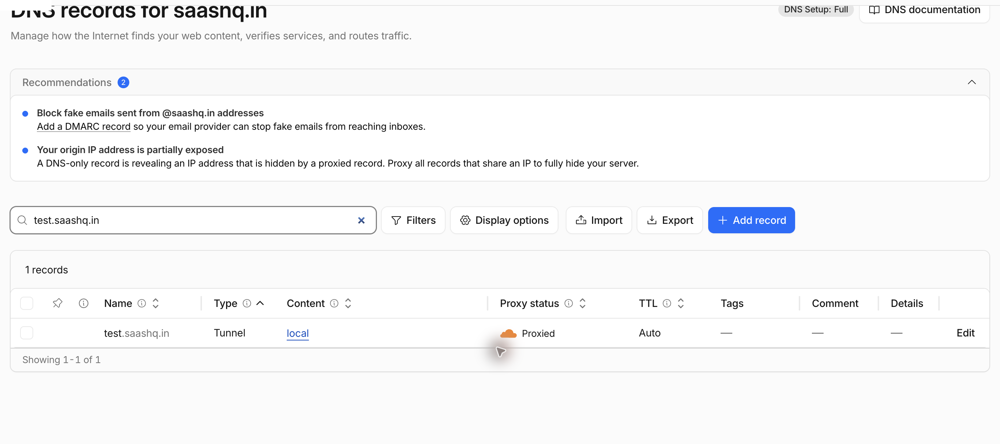
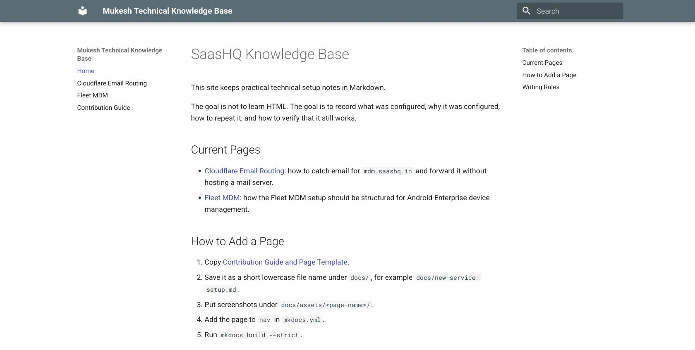

# Cloudflare Tunnel Local Preview

Date: 2026-06-24  
Status: Working  
System: Cloudflare Tunnel, Cloudflare DNS, MkDocs  
Sensitive data: Masked

## Goal

Expose a website running on a local machine to the public internet without opening router ports or assigning a public IP address to the machine.

In this example, the local website runs at:

```text
http://127.0.0.1:8001/
```

The public test URL is:

```text
https://test.saashq.in/
```

## When to Use This

Use this when a developer or tester needs to quickly share a local website with another person, test a webhook callback, verify a mobile-device flow against a reachable URL, or preview a local documentation site from outside the machine.

This setup is temporary. The tunnel runs only while the `cloudflared tunnel run` command is active.

## Final Configuration

- Local website: `http://127.0.0.1:8001/`
- Public hostname: `test.saashq.in`
- Cloudflare Tunnel name: `local`
- DNS record type shown by Cloudflare: `Tunnel`
- Proxy status: `Proxied`
- Runtime mode: temporary command, not a macOS service



## Prerequisites

- Domain is managed in Cloudflare DNS.
- `cloudflared` is installed on the local machine.
- A Cloudflare Tunnel exists, or a new one can be created.
- The local website is already running.

For this test, the local MkDocs site was already running:

```bash
curl -I http://127.0.0.1:8001/
```

Expected result:

```text
HTTP/1.0 200 OK
```



## Install Cloudflared

On macOS with Homebrew:

```bash
brew install cloudflared
cloudflared --version
```

Do not start the Homebrew service if the goal is only a temporary preview.

## Create or Reuse a Tunnel

If a tunnel already exists, list it:

```bash
cloudflared tunnel list
```

If a tunnel does not exist, authenticate and create one:

```bash
cloudflared tunnel login
cloudflared tunnel create local
```

This creates tunnel credentials under:

```text
~/.cloudflared/
```

Keep the credential JSON file private.

## Add the Public Hostname

Create a DNS route from the public hostname to the tunnel.

If CLI authentication works:

```bash
cloudflared tunnel route dns local test.saashq.in
```

If the CLI cannot create the route, use the Cloudflare dashboard:

1. Open Cloudflare dashboard.
2. Open the domain.
3. Go to DNS records.
4. Add a record for `test.saashq.in`.
5. Point it to the tunnel named `local`.
6. Keep proxy enabled.

The DNS table should show one record for `test.saashq.in`, with type `Tunnel`, content `local`, and proxy status `Proxied`.

## Create a Temporary Config

Create a temporary config outside the repository:

```bash
cat > /tmp/saashq-test-tunnel.yml <<'EOF'
tunnel: <tunnel-id>
credentials-file: ~/.cloudflared/<tunnel-id>.json

ingress:
  - hostname: test.saashq.in
    service: http://127.0.0.1:8001
  - service: http_status:404
EOF
```

Use the real tunnel ID and credential path from `cloudflared tunnel list`.

## Run the Tunnel

Start the tunnel manually:

```bash
cloudflared tunnel --config /tmp/saashq-test-tunnel.yml run local
```

Successful startup shows registered tunnel connections and Cloudflare connectivity checks passing.

Leave this terminal running while the public preview is needed.

## Verify the Public URL

Check DNS and HTTP from another terminal:

```bash
dig +short test.saashq.in @1.1.1.1
curl -I -L https://test.saashq.in/
```

Expected result:

```text
HTTP/2 200
```

Open the public URL in a browser and confirm it shows the same local site.


## Stop the Tunnel

Stop the running `cloudflared` command with `Ctrl+C`.

After stopping, the public hostname should no longer serve the local site:

```bash
curl -I -L https://test.saashq.in/
```

Expected result when the tunnel is stopped:

```text
HTTP/2 530
```

## Troubleshooting

| Symptom | Check | Fix |
| --- | --- | --- |
| Public URL returns `530` | Is `cloudflared tunnel run` active? | Start the tunnel again. |
| Public URL returns `404` | Does the temporary config include the hostname? | Add `hostname: test.saashq.in` under `ingress`. |
| Local URL fails | Is the local website running? | Start the local dev server first. |
| DNS route command fails | Is CLI auth valid? | Add the tunnel hostname from the Cloudflare dashboard instead. |
| Browser shows stale content | Is another site using the same hostname? | Check the Cloudflare DNS record and tunnel route. |

## Maintenance Notes

- Keep this page focused on temporary tunnel previews.
- Keep tunnel credential files out of the repository.
- Keep screenshots redacted before publishing.
- Do not document personal Cloudflare account usernames or mailbox names.
