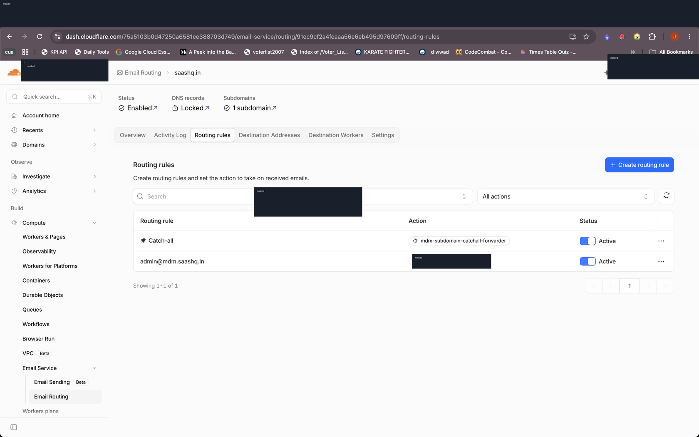
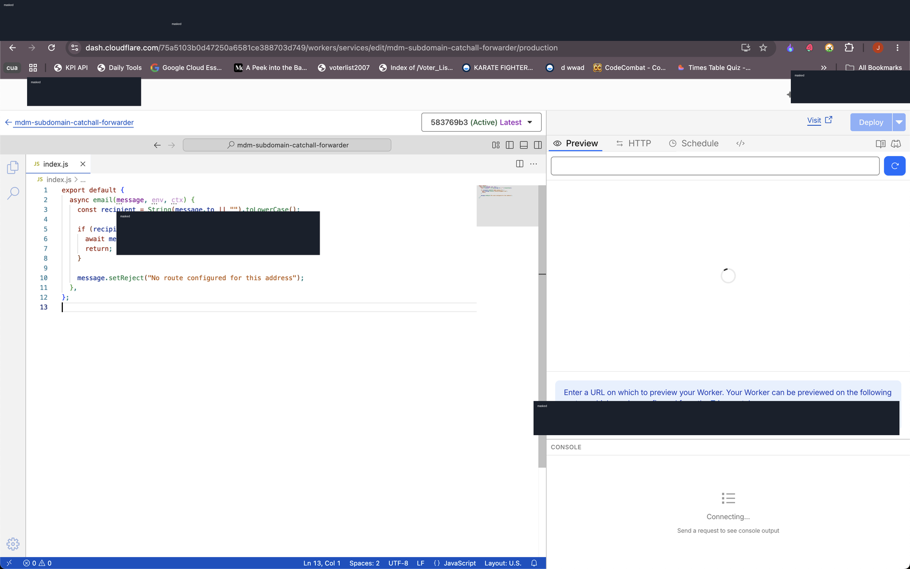
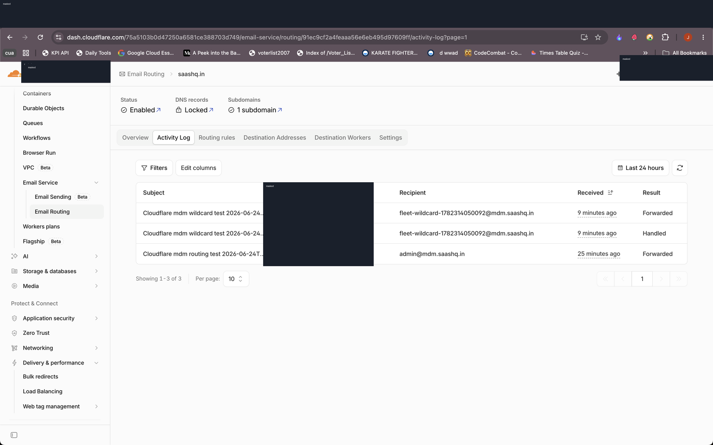
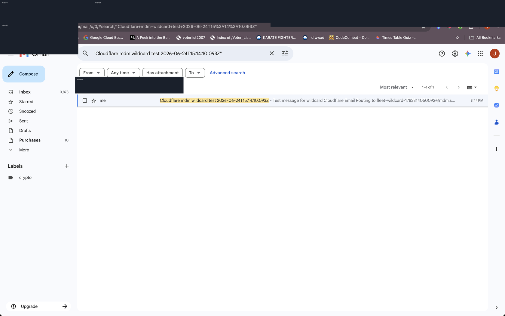

# Cloudflare Email Routing for Fleet MDM

Date: 2026-06-24  
Status: Working  
System: Cloudflare Email Routing, Cloudflare Workers, Fleet MDM  
Sensitive data: Masked

## Goal

Route any email address ending in `@mdm.saashq.in` to `masked-destination@gmail.com` without hosting an email server.

This is useful for Fleet MDM because the admin or enrollment-related email address can live under the MDM subdomain while the actual mailbox remains a normal Gmail inbox.

## Final Result

- Wildcard behavior: `*@mdm.saashq.in` forwards to `masked-destination@gmail.com`.
- Exact route kept active: `admin@mdm.saashq.in`.
- Email Worker: `mdm-subdomain-catchall-forwarder`.
- Verification address: `fleet-wildcard-1782314050092@mdm.saashq.in`.
- Cloudflare Activity Log result: `Handled` and `Forwarded`.

!!! warning "Cloudflare subdomain catch-all limitation"
    Cloudflare Email Routing does not directly allow a catch-all rule for each subdomain in the dashboard. The working approach is to enable the zone-level catch-all, route it to an Email Worker, and let the worker forward only recipients ending in `@mdm.saashq.in`.

## Final Configuration

1. Email Routing is enabled for `saashq.in`.
2. The Email Routing subdomain `mdm.saashq.in` is enabled.
3. Cloudflare manages/locks the required email DNS records.
4. The destination address `masked-destination@gmail.com` is verified.
5. The exact route `admin@mdm.saashq.in` is active.
6. The catch-all rule is active and points to `mdm-subdomain-catchall-forwarder`.



## Email Worker

The worker filters all catch-all mail. Only addresses ending in `@mdm.saashq.in` are forwarded. Anything else caught by the zone-level catch-all is rejected.

```js
export default {
  async email(message, env, ctx) {
    const recipient = String(message.to || "").toLowerCase();

    if (recipient.endsWith("@mdm.saashq.in")) {
      await message.forward("masked-destination@gmail.com");
      return;
    }

    message.setReject("No route configured for this address");
  },
};
```



## Verification

Test email sent to:

```text
fleet-wildcard-1782314050092@mdm.saashq.in
```

Cloudflare Activity Log showed:

- Subject: `Cloudflare mdm wildcard test 2026-06-24T15:14:10.093Z`
- Recipient: `fleet-wildcard-1782314050092@mdm.saashq.in`
- Result: `Handled`
- Result: `Forwarded`



Gmail search also showed the matching test conversation in the destination mailbox.



## Future Checklist

- Use `admin@mdm.saashq.in` or another address ending in `@mdm.saashq.in` for Fleet MDM.
- If mail stops arriving, check Cloudflare Email Routing -> Activity Log first.
- If Activity Log shows `Handled` but not `Forwarded`, inspect the Email Worker and destination verification.
- If Activity Log has no entry, check DNS/subdomain status under Email Routing settings.
- Keep real mailbox usernames out of screenshots and public docs.

## Maintenance Notes

- Edit this page as Markdown, not HTML.
- Add future screenshots under `docs/assets/mdm-email-routing/`.
- Keep screenshots redacted before committing or publishing.
