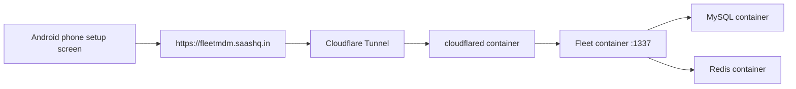
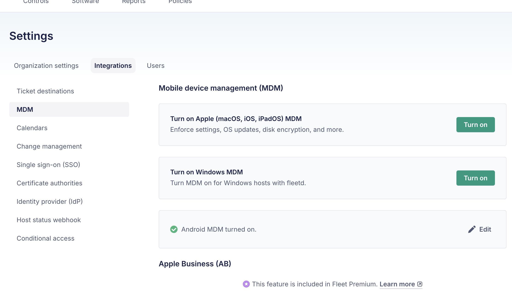
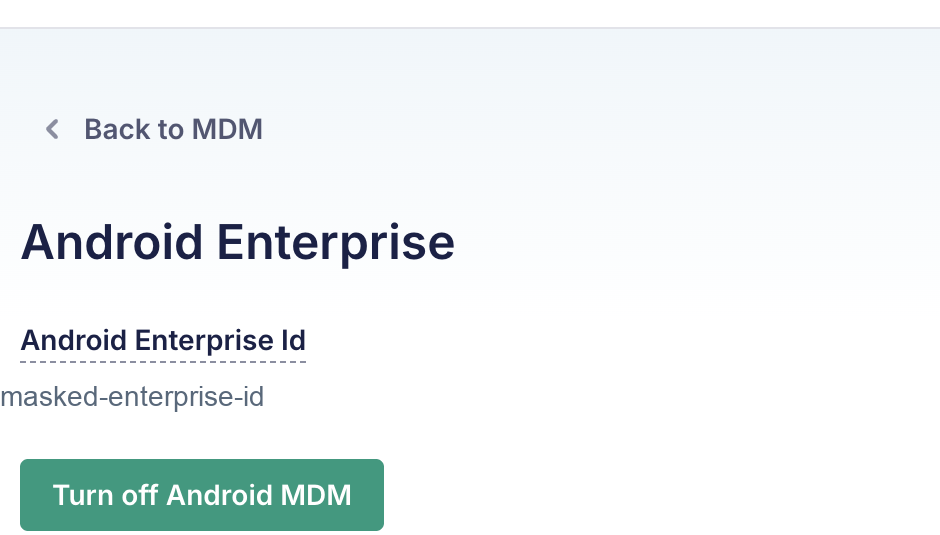
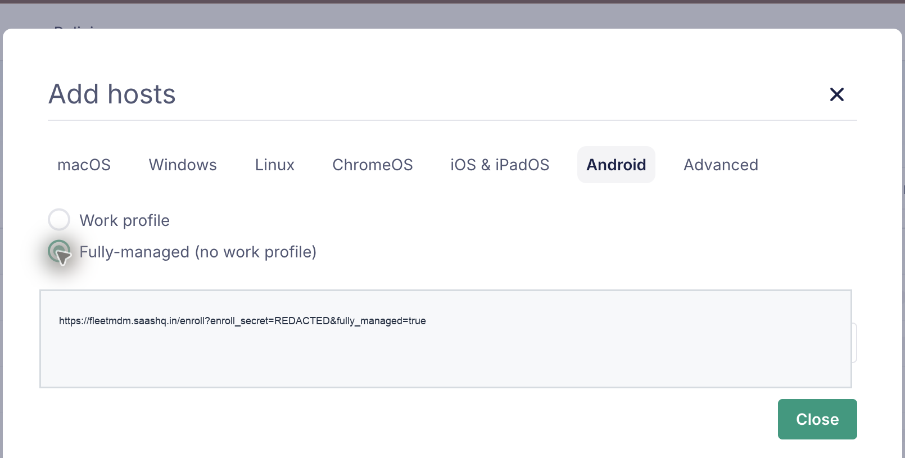

# Fleet MDM on macOS M-Series

Date: 2026-06-24  
Status: Verified locally  
System: [Fleet](https://fleetdm.com/), Docker or OrbStack, Cloudflare Tunnel, Android Enterprise  
Sensitive data: Masked

## Goal

Run Fleet MDM on a macOS Apple Silicon machine and expose it at `https://fleetmdm.saashq.in/` through Cloudflare Tunnel, without opening inbound ports or needing a public IP address.

The Android target is a family phone that should be enrolled as a fully managed Android Enterprise device after factory reset.

## Final Configuration

- Host machine: macOS on Apple Silicon.
- Container runtime: Docker-compatible runtime. OrbStack was installed manually, but Docker Desktop also works if Docker is running.
- Fleet URL: `https://fleetmdm.saashq.in/`.
- Admin email: `admin@mdm.saashq.in`.
- Local Fleet folder: `/Users/<local-user>/Downloads/shastra/fleet-mdm`.
- Public access: Cloudflare Tunnel.
- Android mode: Android Enterprise, fully managed device mode.

## Architecture



Cloudflare receives public HTTPS traffic and forwards it through the tunnel to the local Docker network. Fleet itself is bound to localhost on the Mac, and MySQL/Redis are not exposed publicly.

## Prerequisites

- OrbStack or Docker Desktop is installed and running.
- Cloudflare manages DNS for `saashq.in`.
- Cloudflare Tunnel credentials exist on the machine under `~/.cloudflared`.
- `admin@mdm.saashq.in` can receive email through Cloudflare Email Routing.
- Android Enterprise binding is completed from Fleet.

## Local Files

The Fleet deployment lives here:

```text
/Users/<local-user>/Downloads/shastra/fleet-mdm
```

Important files:

- `docker-compose.yml`: starts Fleet, MySQL, Redis, and cloudflared.
- `.env`: local Fleet/MySQL secrets and runtime settings. Do not publish this file.
- `.fleet-admin-password`: local admin password record. Do not publish this file.
- `cloudflared-fleetmdm-docker.yml`: Cloudflare Tunnel ingress config used by the container.

## Docker Services

The running stack contains:

```text
fleet-mdm-cloudflared-1   cloudflared   running
fleet-mdm-fleet-1         fleet         running   127.0.0.1:1337->1337/tcp
fleet-mdm-mysql-1         mysql         running   127.0.0.1:3306->3306/tcp
fleet-mdm-redis-1         redis         running   127.0.0.1:6379->6379/tcp
```

The Fleet container uses `fleetdm/fleet`. MySQL and Redis are local container dependencies. The cloudflared container uses `cloudflare/cloudflared:2026.6.1`.

## Sanitized Docker Compose Reference

Keep the real `docker-compose.yml` and `.env` files private, but record the shape of the stack so it can be recreated later.

```yaml
services:
  mysql:
    image: mysql:8
    platform: linux/x86_64
    environment:
      - MYSQL_ROOT_PASSWORD=${MYSQL_ROOT_PASSWORD}
      - MYSQL_DATABASE=${MYSQL_DATABASE}
      - MYSQL_USER=${MYSQL_USER}
      - MYSQL_PASSWORD=${MYSQL_PASSWORD}
    volumes:
      - mysql:/var/lib/mysql
    ports:
      - "127.0.0.1:3306:3306"
    restart: unless-stopped

  redis:
    image: redis:6
    command: ["redis-server", "--appendonly", "yes"]
    volumes:
      - redis:/data
    ports:
      - "127.0.0.1:6379:6379"
    restart: unless-stopped

  fleet:
    image: fleetdm/fleet
    platform: linux/x86_64
    depends_on:
      mysql:
        condition: service_healthy
      redis:
        condition: service_healthy
    command: sh -c "/usr/bin/fleet prepare db --no-prompt && /usr/bin/fleet serve"
    environment:
      - FLEET_REDIS_ADDRESS=redis:6379
      - FLEET_MYSQL_ADDRESS=mysql:3306
      - FLEET_MYSQL_DATABASE=${MYSQL_DATABASE}
      - FLEET_MYSQL_USERNAME=${MYSQL_USER}
      - FLEET_MYSQL_PASSWORD=${MYSQL_PASSWORD}
      - FLEET_SERVER_ADDRESS=${FLEET_SERVER_ADDRESS}:${FLEET_SERVER_PORT}
      - FLEET_SERVER_TLS=${FLEET_SERVER_TLS}
      - FLEET_SERVER_PRIVATE_KEY=${FLEET_SERVER_PRIVATE_KEY}
    ports:
      - "127.0.0.1:${FLEET_SERVER_PORT}:${FLEET_SERVER_PORT}"
    restart: unless-stopped

  cloudflared:
    image: cloudflare/cloudflared:2026.6.1
    depends_on:
      fleet:
        condition: service_healthy
    command:
      - tunnel
      - --no-autoupdate
      - --config
      - /etc/cloudflared/config.yml
      - run
      - <cloudflare-tunnel-id>
    volumes:
      - ./cloudflared-fleetmdm-docker.yml:/etc/cloudflared/config.yml:ro
      - /Users/<local-user>/.cloudflared:/etc/cloudflared:ro
    restart: unless-stopped

volumes:
  mysql:
  redis:
  data:
  logs:
  vulndb:
```

Do not paste `.env` values into the documentation. It is enough to document the variable names and where they are used.

## Cloudflare Tunnel

The tunnel ingress maps the public hostname to Fleet inside the Docker network:

```yaml
ingress:
  - hostname: fleetmdm.saashq.in
    service: http://fleet:1337
  - service: http_status:404
```

This is why the public URL works even though the Mac does not expose Fleet directly to the internet.

## Start Or Restart

From the Fleet deployment folder:

```bash
cd /Users/<local-user>/Downloads/shastra/fleet-mdm
docker compose up -d
docker compose ps
```

If OrbStack or Docker is not running, start it first and then run the commands again.

## Android Enterprise Binding

Android Enterprise binding must be completed before Android phones can be enrolled. The correct sequence is:

1. In Fleet, open the MDM integrations page.
2. Start the Android Enterprise connection from that page.
3. Complete the Google Android Enterprise signup and binding flow.
4. Return to Fleet and confirm Android MDM is turned on.
5. Open the Android Enterprise detail page only if you need to view the enterprise binding or turn Android MDM off.

Start in Fleet:

```text
Settings -> Integrations -> MDM
```

Before binding, this page has the Android MDM action to connect Android Enterprise. After binding, the same page shows `Android MDM turned on.`



When the Android MDM action is selected, Fleet opens Google's Android Enterprise signup flow. In this setup, `admin@mdm.saashq.in` was used as the work email. The Google flow may include email verification, account details, free Android Enterprise subscription confirmation, password setup, and an `Allow` or `Allow and create account` step that binds the Android Enterprise account back to Fleet.

After Google's flow redirects back to Fleet, confirm the result here:

```text
Settings -> Integrations -> MDM
```

The Android Enterprise detail page is not the starting point for setup. It is the post-binding management page that appears after Android MDM is already turned on. Open it from the Android MDM row by selecting `Edit`.



This page shows the Android Enterprise binding ID and the `Turn off Android MDM` action. The enterprise ID is masked in the screenshot.

## Android Enrollment

Enroll Android hosts only after Android MDM is turned on. In Fleet, go to:

```text
Hosts -> Add hosts -> Android
```

This is the Android tab in the Add hosts dialog:



Fleet offers two Android enrollment options:

- `Work profile`: useful when a personal phone keeps personal data separate from managed work apps.
- `Fully-managed (no work profile)`: useful when the whole device should be managed by MDM.

For the family phone use case, choose `Fully-managed (no work profile)`.

The enrollment URL is masked because it contains an enrollment secret.

## Phone Setup Flow

Use this only after intentionally factory resetting the Android phone.

1. Turn on the phone after factory reset.
2. On the first welcome screen, tap the screen 6 times.
3. Scan the Fleet Android enrollment QR code.
4. Connect to Wi-Fi when prompted.
5. Follow Android setup instructions until Fleet enrollment completes.
6. Confirm the device appears under Fleet hosts.

## Verification Commands

Run these from the Mac:

```bash
cd /Users/<local-user>/Downloads/shastra/fleet-mdm
docker compose ps
curl -s -o /dev/null -w 'local_health=%{http_code}\n' http://127.0.0.1:1337/healthz
curl -s -o /dev/null -w 'public_root=%{http_code}\n' -L https://fleetmdm.saashq.in/
```

Verified result on 2026-06-24:

```text
local_health=200
public_root=200
```

## Troubleshooting

If `https://fleetmdm.saashq.in/` does not load:

- Confirm OrbStack or Docker is running.
- Run `docker compose ps` and check that `fleet`, `mysql`, `redis`, and `cloudflared` are running.
- Check tunnel logs with `docker compose logs --tail=100 cloudflared`.
- Check Fleet logs with `docker compose logs --tail=100 fleet`.

If Android Enterprise setup shows a Google robot or unusual-activity page:

- Complete the browser step manually from the same Chrome session.
- Check the email inbox for `admin@mdm.saashq.in`.
- Return to Fleet and confirm Android Enterprise is enabled.

If the Android QR enrollment fails:

- Regenerate or reopen the Fleet enrollment instructions.
- Make sure `Fully-managed (no work profile)` is selected.
- Make sure the phone is at the fresh factory setup screen.
- Make sure the phone can reach the internet during setup.

## Security Notes

- Do not publish `.env`, `.fleet-admin-password`, Cloudflare tunnel credentials, or enrollment URLs.
- Treat the Fleet Android enrollment URL like a secret.
- Keep MySQL and Redis bound to localhost only.
- Prefer Cloudflare Tunnel over exposing Fleet directly from the Mac.
- Document each policy change after the first Android device enrolls.

## Next Steps

- Enroll the Android phone after factory reset.
- Confirm the phone appears in Fleet.
- Record which restrictions Fleet exposes for that exact Android/HyperOS version.
- Test remote lock, wipe, and recovery behavior before relying on it.

## References

- [Fleet Android MDM setup](https://fleetdm.com/guides/android-mdm-setup): Fleet's setup sequence for connecting Android Enterprise and confirming Android MDM is turned on.
- [Android Enterprise management](https://www.android.com/enterprise/management/): Android Enterprise management overview from Google.
