# Control a Physical iPhone from macOS with Appium

Date: 2026-06-25  
Status: Verified locally  
System: macOS, Xcode, Appium, XCUITest, WebDriverAgent, physical iPhone  
Sensitive data: Masked  
Last verified: 2026-06-25

## Goal

Set up a Mac and a physical iPhone so Appium can control the iPhone over USB for repeatable automation work.

The working end state is:

- The iPhone appears in Xcode as a trusted physical device.
- Xcode has an Apple account, personal team, and Apple Development certificate.
- WebDriverAgentRunner installs and runs on the iPhone.
- Appium can take screenshots, read UI source, tap, swipe, type, open apps, and close sessions.

This guide assumes the engineer is using a Mac and iPhone for the first time.

## What This Setup Does

- Appium runs an HTTP automation server on the Mac.
- The XCUITest driver builds and installs WebDriverAgent on the iPhone.
- WebDriverAgent uses Apple's XCTest APIs to interact with the phone.
- The phone remains a normal non-jailbroken iPhone.
- The USB cable stays connected during the setup and the first reliability test.

## Concepts

- **Xcode**: Apple's IDE and build toolchain. Physical iPhone automation depends on Xcode because WebDriverAgent is an iOS test runner that must be built and signed.
- **Xcode Command Line Tools**: Terminal tools such as `xcodebuild`, `xcrun`, and `xctrace`. Appium uses these tools behind the scenes.
- **Apple account**: The account added inside Xcode. A free personal team is enough for local physical-device testing.
- **Team ID**: Apple's identifier for the development team. Appium uses it through `appium:xcodeOrgId`.
- **Certificate**: A signing identity stored in the Mac keychain. For this setup, use an `Apple Development` certificate.
- **Private key**: The secret key paired with the certificate. It stays on the Mac and should not be copied into documentation or scripts.
- **Bundle identifier**: A reverse-DNS app identifier, for example `com.example.WebDriverAgentRunner`.
- **Provisioning profile**: Apple's signed permission file that connects a team, certificate, app identifier, and allowed device.
- **Entitlement**: A signed app permission. Xcode embeds entitlements into the signed app when needed.
- **Developer profile on iPhone**: The iPhone-side trust entry created when a development-signed app is installed.
- **Developer Mode**: iOS setting required on iOS 16 and later before development-signed apps can run reliably.
- **WebDriverAgent**: The XCTest server app that Appium installs on the phone.
- **UDID**: The unique device identifier. Treat it as sensitive and mask it in public docs.

## Final Configuration

- Mac: macOS with Xcode installed.
- Package manager: Homebrew.
- Node.js: installed through Homebrew or another trusted package manager.
- Appium: installed globally with `npm`.
- Appium driver: `xcuitest`.
- iPhone: trusted over USB, Developer Mode enabled.
- WDA bundle ID: use your own unique value, for example `com.example.WebDriverAgentRunner`.

## Mac Setup

### 1. Install Xcode

Open the Mac App Store, search for `Xcode`, and install it.

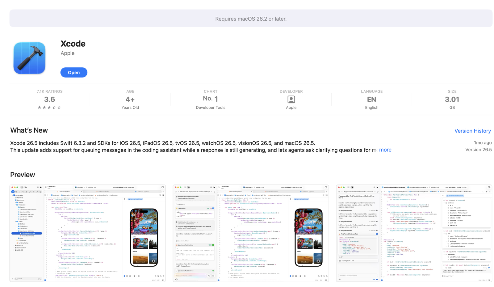

After installation, open Xcode once. If Xcode asks to install additional components or device support, allow it to finish.

Check Xcode from Terminal:

```bash
xcodebuild -version
```

Expected output shape:

```text
Xcode 26.0.1
Build version 17A400
```

Point command line tools at the full Xcode app:

```bash
sudo xcode-select -s /Applications/Xcode.app/Contents/Developer
xcode-select -p
```

Expected output:

```text
/Applications/Xcode.app/Contents/Developer
```

If Xcode asks for a license agreement:

```bash
sudo xcodebuild -license accept
```

No output is also acceptable if the license was already accepted.

### 2. Install Homebrew

Install Homebrew from Terminal:

```bash
/bin/bash -c "$(curl -fsSL https://raw.githubusercontent.com/Homebrew/install/HEAD/install.sh)"
```

Expected output shape:

```text
==> Installation successful!
==> Next steps:
- Run these commands in your terminal to add Homebrew to your PATH
```

Follow the exact `eval` or `echo ... >> ~/.zprofile` instructions printed by Homebrew.

Verify:

```bash
brew --version
```

Expected output shape:

```text
Homebrew 4.x.x
```

### 3. Install USB and iOS helper tools

Install tools used for diagnostics and fallback device inspection:

```bash
brew install node ios-deploy libimobiledevice ideviceinstaller pipx
```

Expected output shape:

```text
==> Pouring node--...
==> Pouring ios-deploy--...
==> Pouring libimobiledevice--...
==> Pouring ideviceinstaller--...
```

Verify Node and npm:

```bash
node -v
npm -v
```

Expected output shape:

```text
v24.x.x
11.x.x
```

Verify USB tools:

```bash
ios-deploy --version
idevice_id -l
```

Expected output shape:

```text
1.12.2
<masked-device-udid>
```

Install `pymobiledevice3` as an optional diagnostic backup.

- `pymobiledevice3` is a Python CLI for inspecting and troubleshooting iOS devices.
- The upstream project documents `python3 -m pip install -U pymobiledevice3`.
- This guide uses `pipx` because Homebrew-managed Python on macOS often blocks global `pip` installs.
- `pipx` creates a separate virtual environment for the command and exposes `pymobiledevice3` on your shell path.
- If `pipx ensurepath` says it changed your shell path, open a new Terminal tab before running `pymobiledevice3`.

```bash
pipx ensurepath
pipx install pymobiledevice3
pymobiledevice3 usbmux list
```

Expected output shape:

```text
Success! Added ... to the PATH environment variable.
installed package pymobiledevice3 ...
These apps are now globally available
  - pymobiledevice3
Device:
  Identifier: <masked-device-udid>
  ConnectionType: USB
```

## Appium Setup

### 4. Install Appium

Install Appium globally with npm:

```bash
npm install -g appium
appium -v
```

Expected output:

```text
3.5.2
```

Install the XCUITest driver:

```bash
appium driver install xcuitest
appium driver list --installed
```

Expected output shape:

```text
✔ Installing 'xcuitest' using NPM install spec 'appium-xcuitest-driver'
xcuitest@11.14.1 [installed (npm)]
```

Install Appium Doctor:

```bash
npm install -g @appium/doctor
appium-doctor --version
```

Expected output shape:

```text
2.1.15
```

Use Appium Doctor as a checklist, not as the only source of truth:

```bash
appium-doctor --ios
```

Expected output shape:

```text
info AppiumDoctor ### Diagnostic starting ###
info AppiumDoctor  ✔ Xcode is installed
info AppiumDoctor  ✔ xcodebuild exists
```

## Xcode Account and Signing

### 5. Add an Apple account in Xcode

Open:

```text
Xcode -> Settings -> Apple Accounts
```

Add your Apple account. After sign-in, open the account's `Personal Team`.

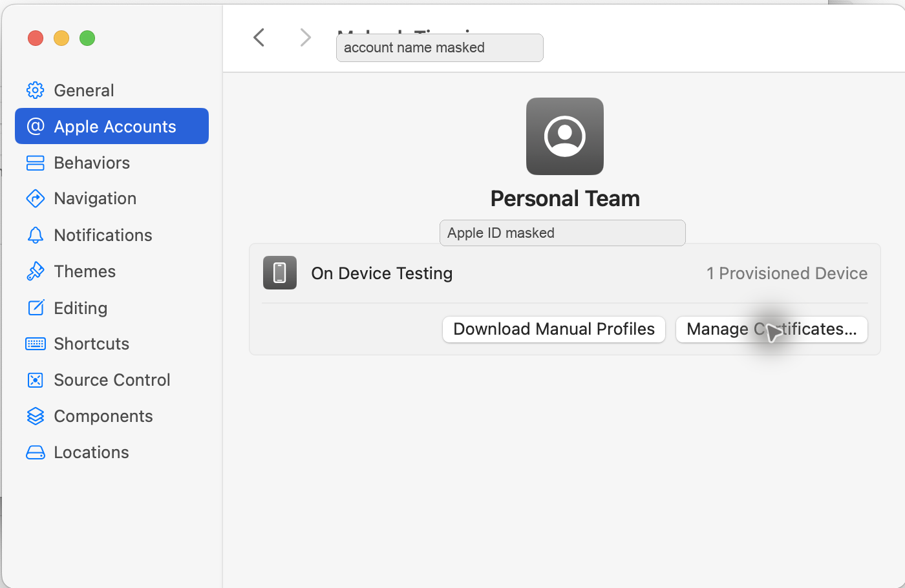

### 6. Create an Apple Development certificate

In the same team detail screen, click:

```text
Manage Certificates...
```

If there is no certificate:

1. Click `+`.
2. Choose `Apple Development`.
3. Wait for Xcode to create the certificate.

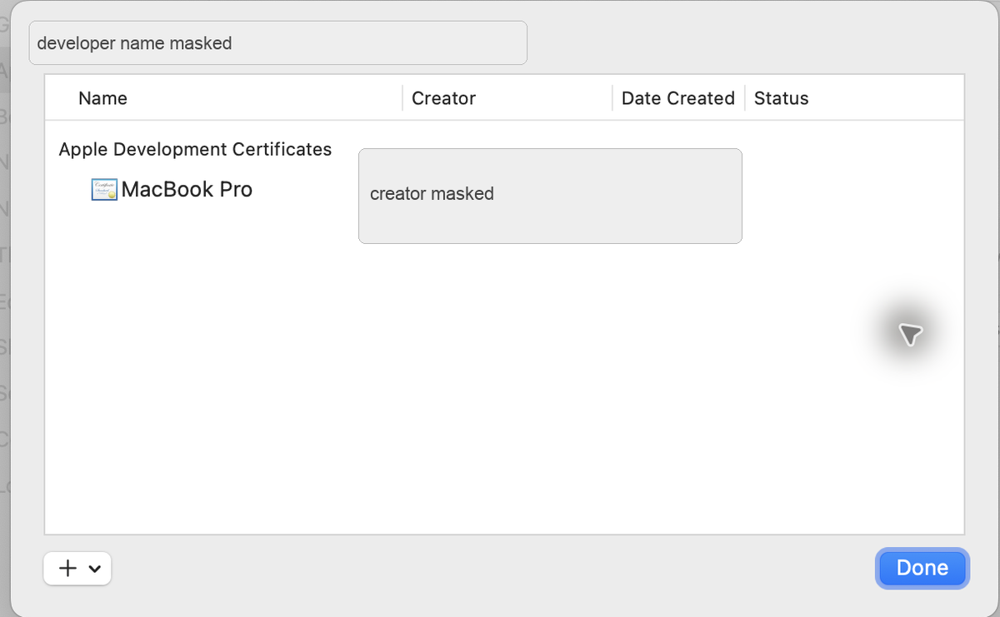

The certificate and private key stay in the Mac keychain. Do not paste keychain exports, `.p12` files, or certificate passwords into documentation.

## iPhone Setup

### 7. Connect and trust the iPhone

Connect the iPhone to the Mac with a USB cable.

On the iPhone, accept:

```text
Trust This Computer?
```

Enter the iPhone passcode if prompted.

This trust popup appears before Appium can capture screenshots. Verify the result in Xcode instead:

```text
Xcode -> Window -> Devices and Simulators
```

The iPhone should appear under `Connected`.

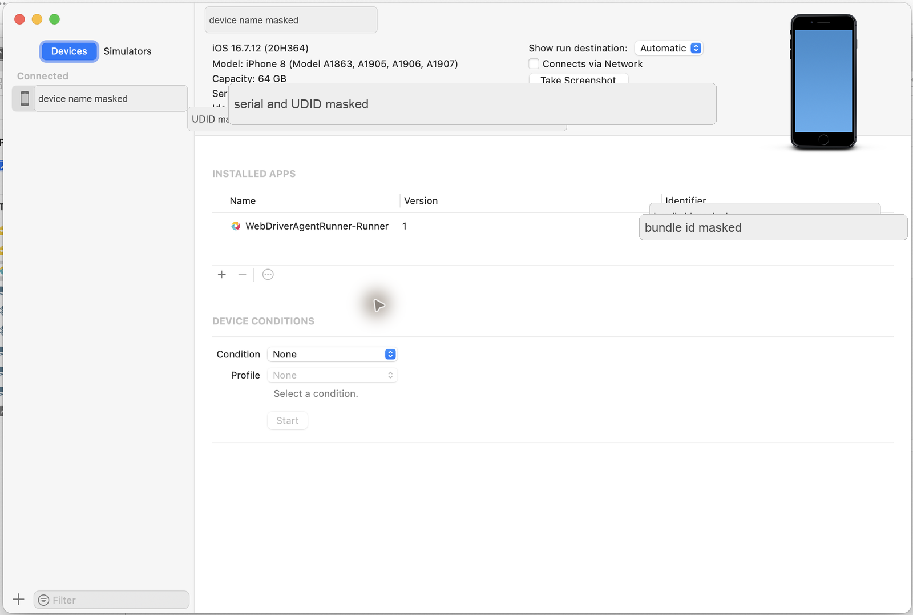

Verify from Terminal:

```bash
xcrun xctrace list devices
```

Expected output shape:

```text
== Devices ==
<device-name> (16.7.12) (<masked-device-udid>)
```

Also verify USB visibility:

```bash
pymobiledevice3 usbmux list
```

Expected output shape:

```text
Identifier: <masked-device-udid>
ConnectionType: USB
```

### 8. Keep the iPhone stable during setup

On the iPhone, keep these temporary setup defaults:

- Keep the phone unlocked.
- Keep the USB cable connected.
- Disable short auto-lock temporarily.
- Stay near the Home screen or Settings app during first setup.
- Avoid passcode prompts while WebDriverAgent is launching.

Start from the iPhone Settings app:

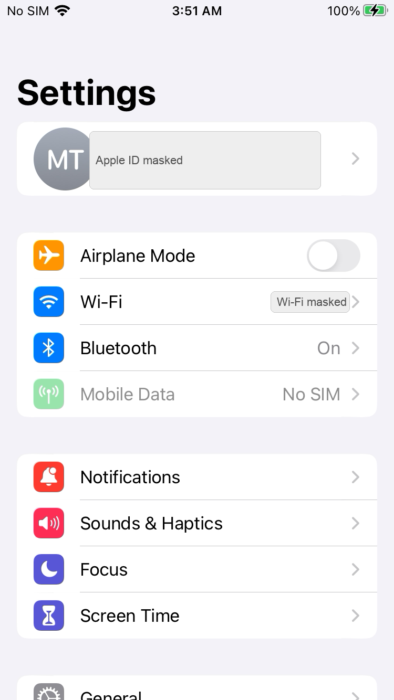{ .iphone-screenshot }

### 9. Enable Developer Mode

Open:

```text
Settings -> Privacy & Security -> Developer Mode
```

Developer Mode appears near the bottom of `Privacy & Security`.

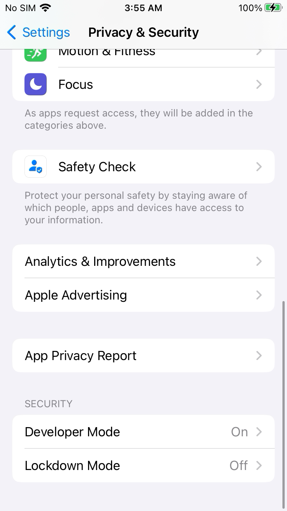{ .iphone-screenshot }

Open `Developer Mode`, turn it on, and restart the iPhone if iOS asks.

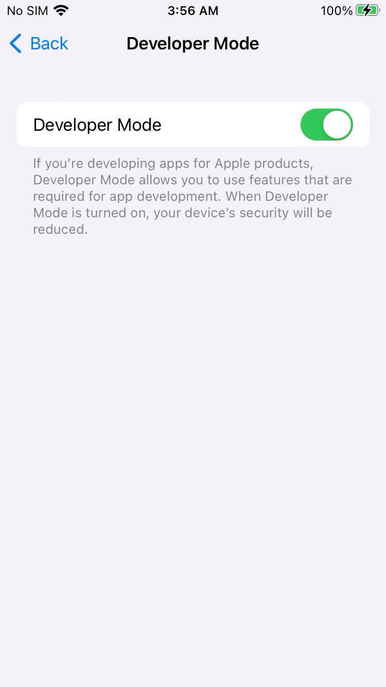{ .iphone-screenshot }

### 10. Enable UI Automation

Open:

```text
Settings -> Developer
```

The `Developer` row appears in Settings after Developer Mode is available.

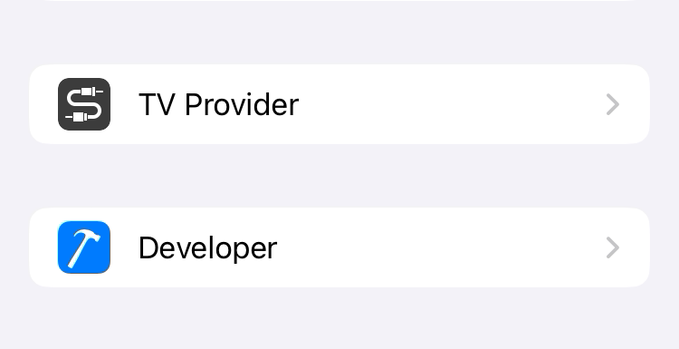{ .iphone-screenshot }

Turn on:

```text
Enable UI Automation
```

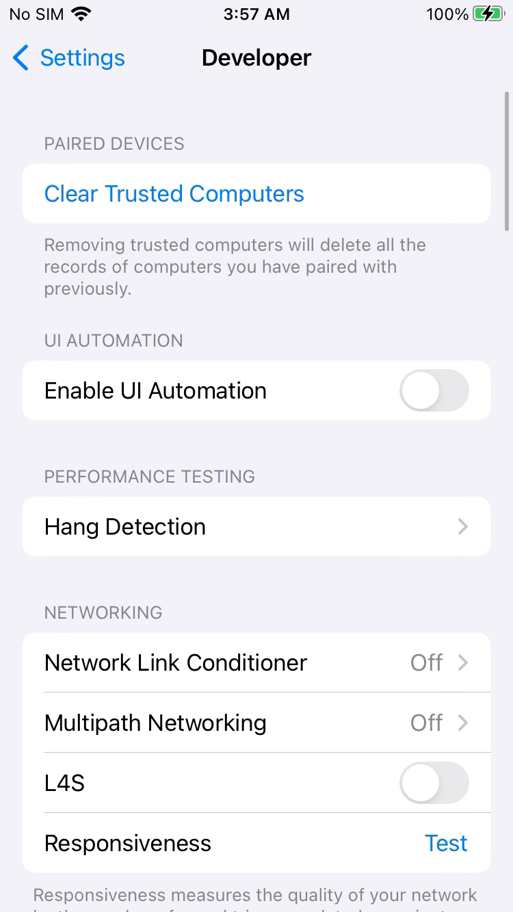{ .iphone-screenshot }

Why this is required:

- `Enable UI Automation` allows XCTest-based tools to inspect and control the iPhone UI.
- Appium does not directly control the iPhone screen by itself. Appium talks to WebDriverAgent, and WebDriverAgent uses Apple's XCTest UI automation APIs.
- If UI Automation is disabled, WebDriverAgent may still install, but Appium commands such as screenshot, source, tap, swipe, and app launch can fail or behave inconsistently.
- Keep this setting enabled when using Appium with the XCUITest driver, WebDriverAgentRunner, XCTest UI tests, or any local tool that needs to automate visible iPhone UI.

This setting is different from `Developer Mode`:

- `Developer Mode` allows development-signed apps such as WebDriverAgentRunner to run.
- `Enable UI Automation` allows XCTest automation to interact with the visible UI.
- For normal Appium real-device use, both should be enabled.

### 11. Trust the WebDriverAgent developer app

After WebDriverAgent is installed for the first time, open:

```text
Settings -> General -> VPN & Device Management
```

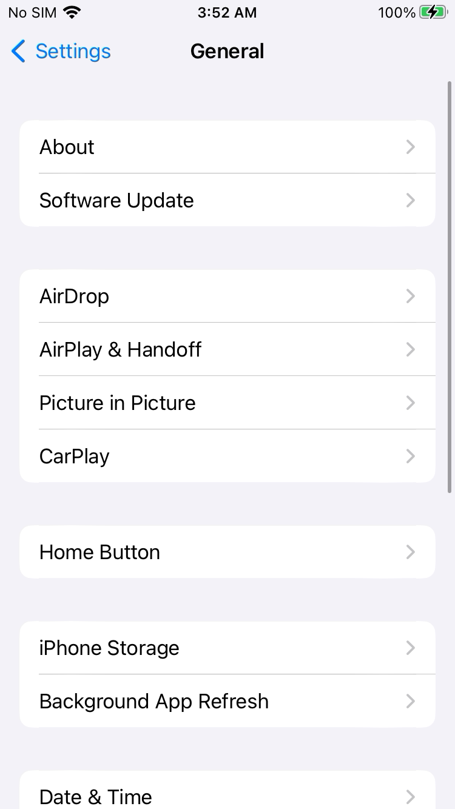{ .iphone-screenshot }

Scroll to `VPN & Device Management`.

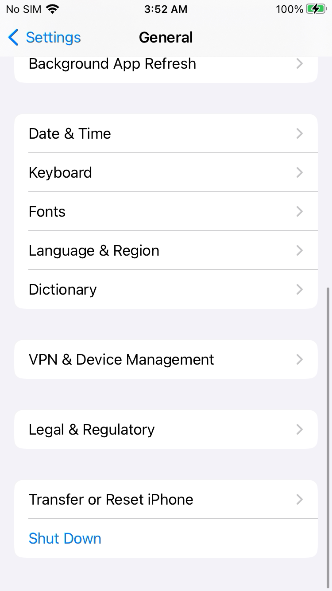{ .iphone-screenshot }

Open the developer app profile.

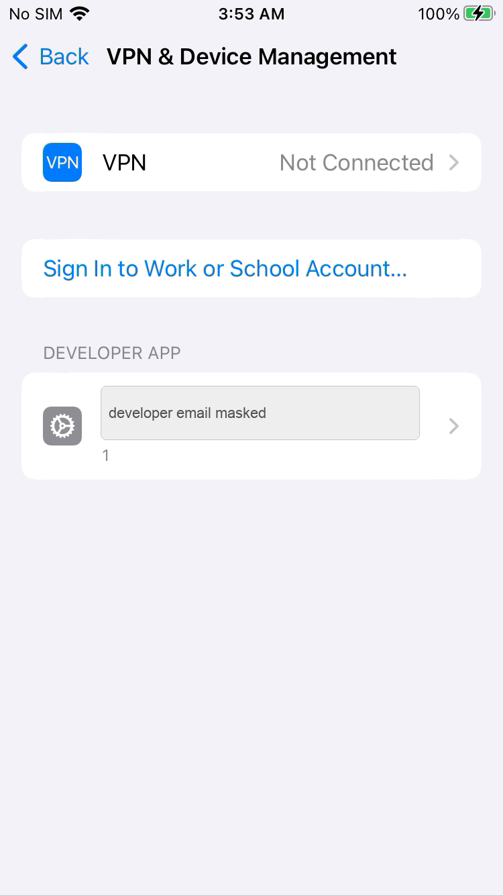{ .iphone-screenshot }

Trust the developer profile if iOS asks. A trusted WebDriverAgent profile looks like this:

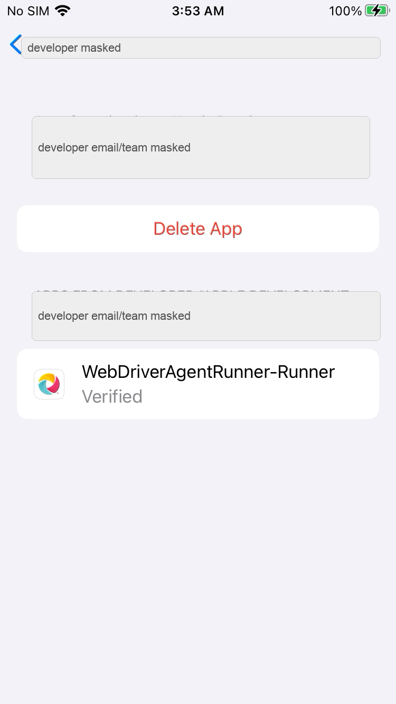{ .iphone-screenshot }

## WebDriverAgent Setup

### 12. Locate WebDriverAgent

After installing the XCUITest driver, WebDriverAgent is inside the Appium driver folder.

Find it:

```bash
find ~/.appium -path '*appium-webdriveragent/WebDriverAgent.xcodeproj' -print -quit
```

Expected output shape:

```text
/Users/<mac-user>/.appium/node_modules/appium-xcuitest-driver/node_modules/appium-webdriveragent/WebDriverAgent.xcodeproj
```

Open it:

```bash
open "$(find ~/.appium -path '*appium-webdriveragent/WebDriverAgent.xcodeproj' -print -quit)"
```


### 13. Understand the signing failure

If Xcode shows this error, the project has no development team selected:

```text
Signing for "WebDriverAgentRunner" requires a development team.
```

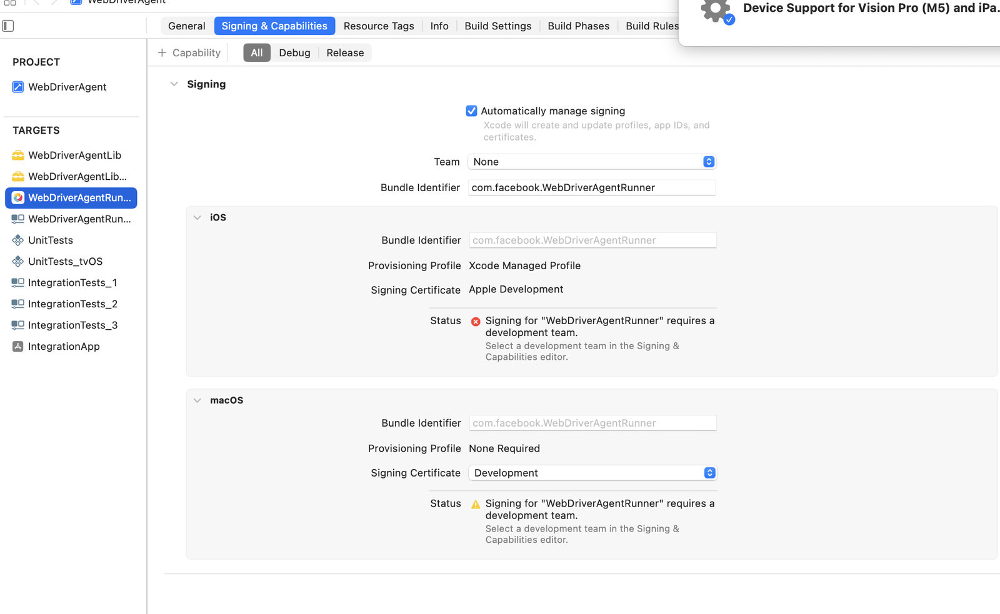

There are two valid ways to fix it.

Recommended for repeatable Appium sessions:

- Do not manually edit the Appium-installed WebDriverAgent project.
- Pass signing values as Appium capabilities.
- Use `appium:xcodeOrgId`, `appium:xcodeSigningId`, and `appium:updatedWDABundleId`.

Manual Xcode fallback:

- Select `WebDriverAgentRunner`.
- Open `Signing & Capabilities`.
- Choose your team.
- Change the bundle identifier to something unique, for example `com.example.WebDriverAgentRunner`.
- Let Xcode create a managed provisioning profile.

## Start Appium

### 14. Start the Appium server

Run:

```bash
appium --log-level info --base-path /
```

Expected output shape:

```text
[Appium] Welcome to Appium v3.5.2
[Appium] Appium REST http interface listener started on http://0.0.0.0:4723
```

Leave this terminal running.

From another terminal, check server status:

```bash
curl -sS http://127.0.0.1:4723/status
```

Expected output shape:

```json
{
  "value": {
    "ready": true,
    "message": "The server is ready to accept new connections"
  }
}
```

### 15. Create a real-device session

Replace placeholders before running:

- `<device-name>`
- `<ios-version>`
- `<device-udid>`
- `<team-id>`
- `<unique-wda-bundle-id>`

```bash
curl -sS -X POST http://127.0.0.1:4723/session \
  -H 'Content-Type: application/json' \
  -d '{
    "capabilities": {
      "alwaysMatch": {
        "platformName": "iOS",
        "appium:automationName": "XCUITest",
        "appium:deviceName": "<device-name>",
        "appium:platformVersion": "<ios-version>",
        "appium:udid": "<device-udid>",
        "appium:bundleId": "com.apple.Preferences",
        "appium:xcodeOrgId": "<team-id>",
        "appium:xcodeSigningId": "Apple Development",
        "appium:updatedWDABundleId": "<unique-wda-bundle-id>",
        "appium:wdaLaunchTimeout": 120000,
        "appium:newCommandTimeout": 120
      },
      "firstMatch": [{}]
    }
  }'
```

Expected output shape:

```json
{
  "value": {
    "sessionId": "<appium-session-id>",
    "capabilities": {
      "platformName": "iOS",
      "automationName": "XCUITest"
    }
  }
}
```

Keep the `sessionId`. The examples below use:

```bash
SID="<appium-session-id>"
```

## Verify Control

### 16. Take a screenshot

```bash
curl -sS "http://127.0.0.1:4723/session/$SID/screenshot" \
  | python3 -c 'import sys,json,base64; print(json.load(sys.stdin)["value"])' \
  | base64 --decode > iphone-appium-screenshot.png

file iphone-appium-screenshot.png
```

Expected output:

```text
iphone-appium-screenshot.png: PNG image data
```

### 17. Read UI source

```bash
curl -sS "http://127.0.0.1:4723/session/$SID/source" \
  | python3 -m json.tool \
  | sed -n '1,40p'
```

Expected output shape:

```text
{
    "value": "<?xml version=\"1.0\" encoding=\"UTF-8\"?><AppiumAUT>..."
}
```

### 18. Tap a harmless coordinate

This example taps near the center of the screen. Use it only on a harmless screen such as Settings.

```bash
curl -sS -X POST "http://127.0.0.1:4723/session/$SID/actions" \
  -H 'Content-Type: application/json' \
  -d '{
    "actions": [{
      "type": "pointer",
      "id": "finger1",
      "parameters": { "pointerType": "touch" },
      "actions": [
        { "type": "pointerMove", "duration": 0, "x": 190, "y": 320, "origin": "viewport" },
        { "type": "pointerDown", "button": 0 },
        { "type": "pause", "duration": 80 },
        { "type": "pointerUp", "button": 0 }
      ]
    }]
  }'
```

Expected output:

```json
{"value":null}
```

### 19. Press Home

```bash
curl -sS -X POST "http://127.0.0.1:4723/session/$SID/execute/sync" \
  -H 'Content-Type: application/json' \
  -d '{"script":"mobile: pressButton","args":[{"name":"home"}]}'
```

Expected output:

```json
{"value":null}
```

### 20. Open Settings again

```bash
curl -sS -X POST "http://127.0.0.1:4723/session/$SID/appium/device/activate_app" \
  -H 'Content-Type: application/json' \
  -d '{"bundleId":"com.apple.Preferences"}'
```

Expected output:

```json
{"value":null}
```

### 21. End the session

Always delete the Appium session when finished:

```bash
curl -sS -X DELETE "http://127.0.0.1:4723/session/$SID"
```

Expected output:

```json
{"value":null}
```

Stop the Appium server with `Ctrl+C`.

## Reconnect, Restart, and Daily Use

After the first successful setup, do not repeat the full Xcode signing and iPhone trust flow every day. Separate the one-time setup from the repeat workflow.

What persists:

- The iPhone's `Trust This Computer` decision normally survives unplug, replug, Mac restart, and iPhone restart.
- The trusted Apple Development profile normally survives unplug, replug, Mac restart, and iPhone restart.
- The WebDriverAgent signing setup remains valid as long as the same Apple team, certificate, provisioning profile, and bundle identifier are used.

What does not persist:

- The Appium server process stops when its terminal is closed or the Mac restarts.
- The Appium WebDriver session is temporary. Create a fresh session after reconnecting, restarting, or stopping Appium.
- WebDriverAgent may be relaunched or reinstalled by Appium when needed.

### Daily reconnect checklist

Start with the iPhone unlocked and connected over USB.

Confirm Xcode sees the phone:

```bash
xcrun xctrace list devices | grep -E "iPhone|Devices Offline"
```

Expected output shape:

```text
<device-name> (16.7.12) (<masked-device-udid>)
== Devices Offline ==
```

`Devices Offline` may appear as a section header. The important part is that your iPhone appears above it under available devices.

Confirm USB transport sees the phone:

```bash
pymobiledevice3 usbmux list
```

Expected output shape:

```text
Identifier: <masked-device-udid>
ConnectionType: USB
```

Start Appium:

```bash
appium --address 127.0.0.1 --port 4723 --log-level info
```

Expected output shape:

```text
[Appium] Appium REST http interface listener started on http://127.0.0.1:4723
[Appium] Available drivers:
[Appium]   - xcuitest@...
```

Create a new Appium session using the same capabilities from [Create a real-device session](#15-create-a-real-device-session). Save the returned session ID:

```bash
SID="<appium-session-id>"
```

### Known-good reconnect test

Run this short test after a Mac restart, iPhone restart, unplug/replug, or long idle period.

Check the logical screen size:

```bash
curl -fsS "http://127.0.0.1:4723/session/$SID/window/rect"
```

Expected output:

```json
{"value":{"y":0,"x":0,"width":375,"height":667}}
```

The logical size is in XCTest points. A screenshot from the same iPhone may be larger in physical pixels.

Capture a screenshot:

```bash
curl -fsS "http://127.0.0.1:4723/session/$SID/screenshot" \
  | python3 -c 'import sys,json,base64; sys.stdout.buffer.write(base64.b64decode(json.load(sys.stdin)["value"]))' \
  > /tmp/appium-iphone-reconnect-test.png

file /tmp/appium-iphone-reconnect-test.png
```

Expected output shape:

```text
/tmp/appium-iphone-reconnect-test.png: PNG image data, 750 x 1334
```

Confirm UI source is readable:

```bash
curl -fsS "http://127.0.0.1:4723/session/$SID/source" \
  | python3 -m json.tool \
  | sed -n '1,30p'
```

Expected output shape:

```text
{
    "value": "<?xml version=\"1.0\" encoding=\"UTF-8\"?>..."
}
```

If the phone is on the Home screen, you can also verify a real tap by opening Settings. First confirm the Settings icon is visible in the source:

```bash
curl -fsS "http://127.0.0.1:4723/session/$SID/source" \
  | python3 -c 'import sys,json; print(json.load(sys.stdin)["value"])' \
  | grep 'name="Settings"'
```

Expected output shape:

```text
<XCUIElementTypeIcon ... name="Settings" label="Settings" ...>
```

Tap the Settings icon. Coordinates are in logical XCTest points, not physical screenshot pixels. Adjust the coordinates if your icon layout is different.

```bash
curl -fsS -X POST "http://127.0.0.1:4723/session/$SID/actions" \
  -H 'Content-Type: application/json' \
  -d '{
    "actions": [{
      "type": "pointer",
      "id": "finger1",
      "parameters": { "pointerType": "touch" },
      "actions": [
        { "type": "pointerMove", "duration": 0, "x": 231, "y": 424, "origin": "viewport" },
        { "type": "pointerDown", "button": 0 },
        { "type": "pause", "duration": 100 },
        { "type": "pointerUp", "button": 0 }
      ]
    }]
  }'
```

Expected output:

```json
{"value":null}
```

Confirm Settings opened:

```bash
curl -fsS "http://127.0.0.1:4723/session/$SID/source" \
  | python3 -c 'import sys,json; print(json.load(sys.stdin)["value"])' \
  | grep 'bundleId="com.apple.Preferences"'
```

Expected output shape:

```text
<XCUIElementTypeApplication ... name="Settings" ... bundleId="com.apple.Preferences">
```

### When to repeat iPhone trust

Do not repeat the iPhone trust steps for normal unplug/replug. Repeat the trust flow only when something material changes:

- WebDriverAgent is signed with a different Apple team or certificate.
- `appium:updatedWDABundleId` changes.
- Xcode recreates signing with a different provisioning profile.
- The iPhone is erased, reset, or its developer trust settings are reset.
- Developer Mode is disabled and re-enabled.
- WebDriverAgent is deleted and reinstalled with different signing.

### Fast recovery after reconnect

If the device is not found:

1. Unlock the iPhone.
2. Wait 10-20 seconds.
3. Rerun `xcrun xctrace list devices`.
4. Rerun `pymobiledevice3 usbmux list`.
5. Unplug and replug the USB cable.

If Appium cannot create a session:

1. Delete any old session if you still have its ID.
2. Stop Appium with `Ctrl+C`.
3. Confirm the phone is unlocked.
4. Start Appium again.
5. Create a fresh session.

Rebuild or re-sign WebDriverAgent only after the reconnect checks pass but session creation fails with a clear signing, provisioning, or WebDriverAgent launch error.

## Reliability Test

Before building a wrapper, MCP bridge, or WDIO layer, prove raw Appium works.

Run 10 cycles manually or from a small script:

- Take screenshot.
- Get UI source.
- Tap a harmless coordinate.
- Swipe or scroll.
- Press Home.
- Open Settings.

Pass condition:

- 10 consecutive cycles complete without WDA crash.
- The USB device does not disconnect.
- Appium does not lose the session.
- Screenshots and source are returned in every cycle.

On this Mac and iPhone, the raw Appium stack completed 10 consecutive cycles successfully on 2026-06-25.

## Troubleshooting

| Symptom | Check | Fix |
| --- | --- | --- |
| `xcrun xctrace list devices` does not show the iPhone | USB cable, trust state, unlocked phone | Reconnect USB, unlock iPhone, accept `Trust This Computer`. |
| Appium session fails with signing error | Xcode account, certificate, team ID, WDA bundle ID | Add Apple account in Xcode, create Apple Development certificate, use a unique `appium:updatedWDABundleId`. |
| iPhone says developer app is not trusted | iPhone developer profile | Open `Settings -> General -> VPN & Device Management` and trust the developer app. |
| WDA launch times out | Phone locked or Developer Mode off | Unlock phone, confirm Developer Mode is on, retry session creation. |
| `appium driver list --installed` does not show `xcuitest` | Driver installation | Run `appium driver install xcuitest`. |
| Appium hangs during a command | WDA or XCTest is stuck | Delete the session, stop Appium, unlock phone, restart Appium. |
| Device disappears during test | USB instability | Use a known-good cable and avoid USB hubs during first setup. |
| Xcode asks for iOS platform support | Missing Xcode device support | Let Xcode install required platform/device support components. |

## Security Notes

- Do not publish UDIDs, serial numbers, Apple IDs, team IDs, or signing keys.
- Do not share Apple account passwords, OTPs, private keys, `.p12` files, or recovery codes.
- Use a unique WDA bundle ID per developer or machine.
- Keep screenshots redacted before publishing.
- Prefer raw Appium first. Add WDIO, MCP, or other wrappers only after Appium itself is stable.

## References

- [Appium Install Appium](https://appium.io/docs/en/latest/quickstart/install/): Appium installation and server startup.
- [Appium XCUITest Device Preparation](https://appium.github.io/appium-xcuitest-driver/latest/preparation/real-device-config/): real-device requirements such as trusted device, Developer Mode, UI Automation, and provisioning.
- [Appium XCUITest Capabilities](https://appium.github.io/appium-xcuitest-driver/latest/reference/capabilities/): `xcodeOrgId`, `xcodeSigningId`, `updatedWDABundleId`, and WDA timeout capabilities.
- [Homebrew Installation](https://brew.sh/): Homebrew install command and shell setup.
- [Apple Xcode](https://developer.apple.com/xcode/): Xcode toolchain overview.

## Maintenance Notes

- Update command outputs when Appium, Xcode, or iOS versions change.
- Keep all screenshots in `docs/assets/ios-real-device-appium-control/`.
- Keep raw screenshots out of the repository because they often contain Apple IDs, UDIDs, serial numbers, or installed app names.
- Re-run `mkdocs build --strict` after each edit.
