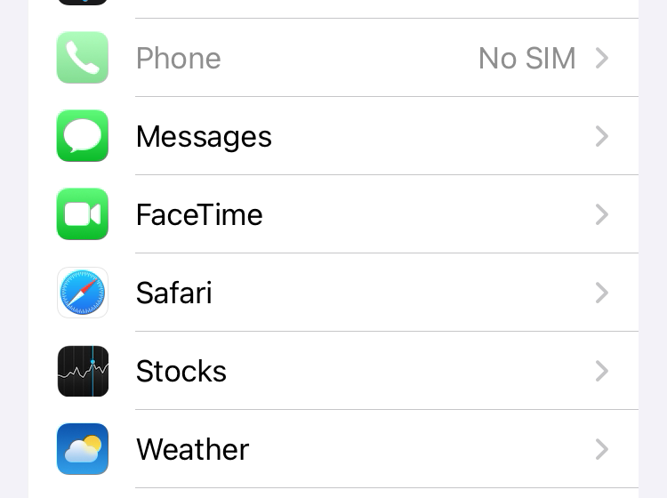
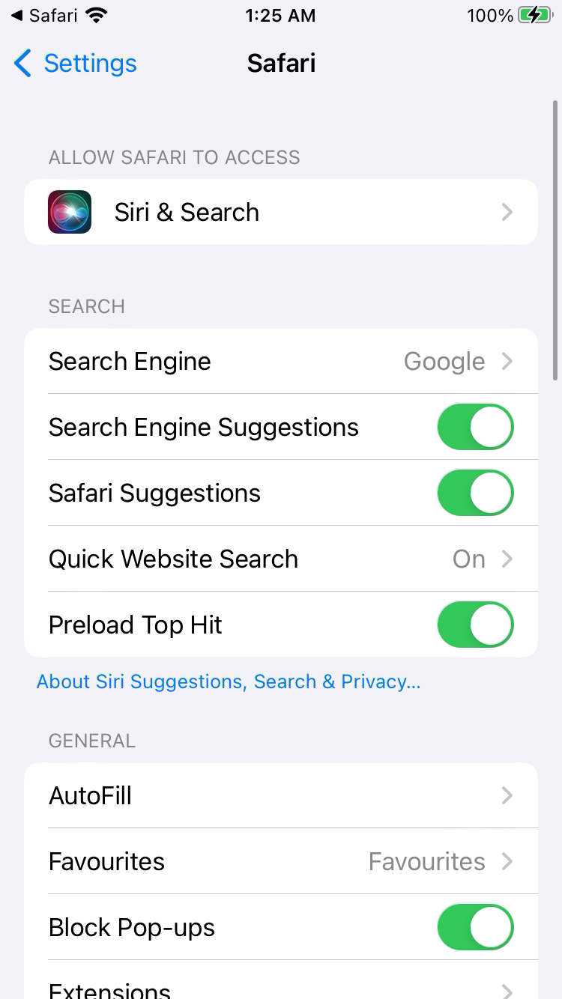
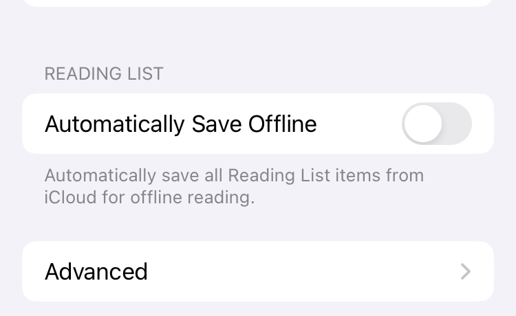
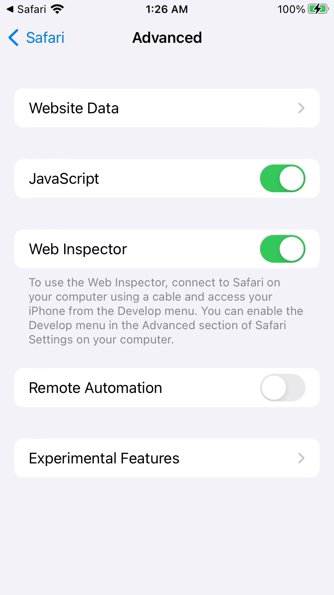
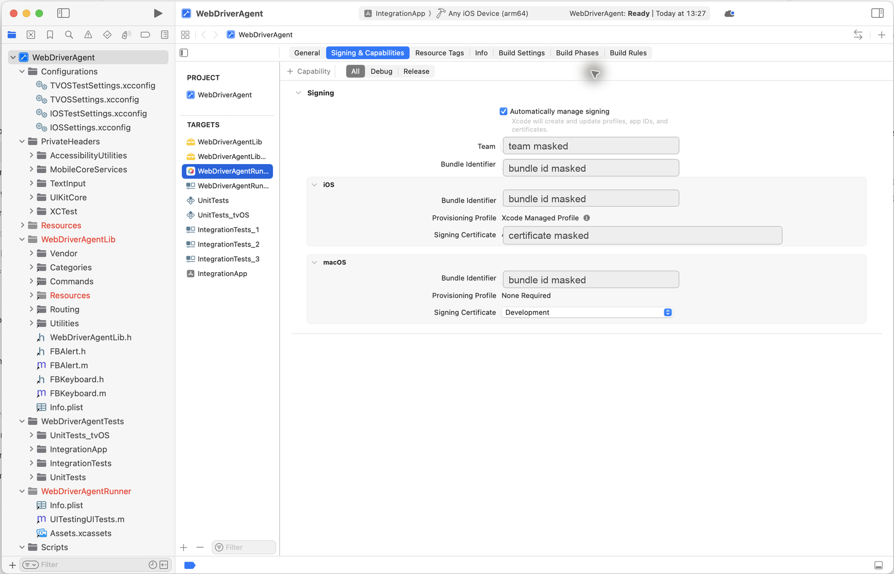
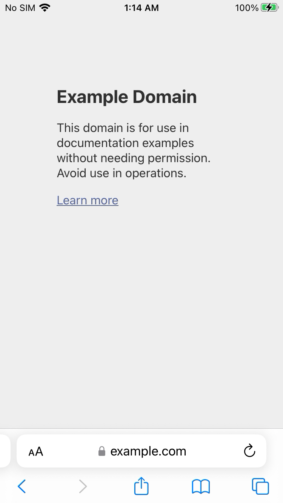
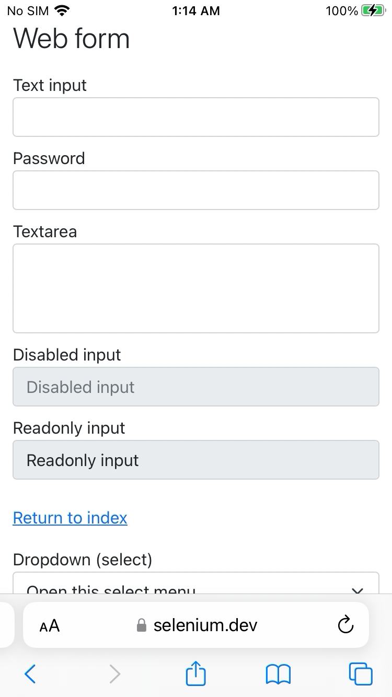
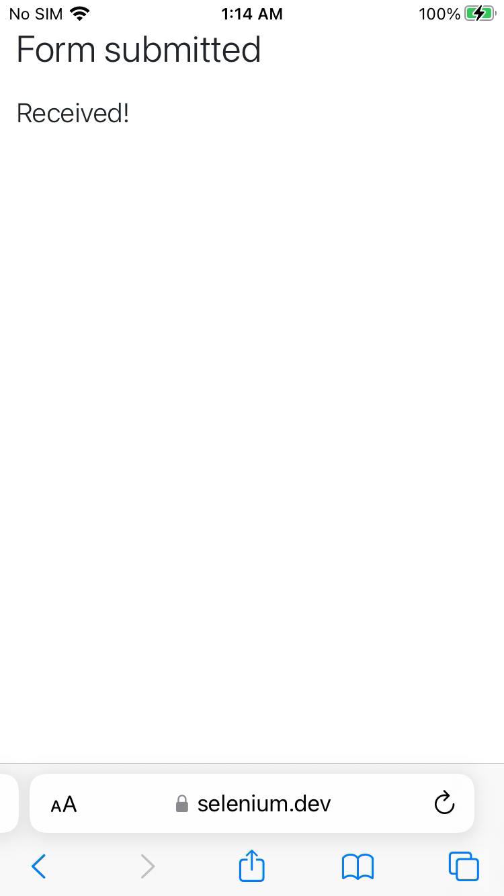

# Control a Physical iPhone from macOS with Appium

Date: 2026-06-25<br>
Status: Verified locally<br>
System: macOS, Xcode, Appium, XCUITest, WebDriverAgent, physical iPhone, Mobile Safari<br>
Sensitive data: Masked<br>
Last verified: 2026-06-26

## Goal

Set up a Mac and a physical iPhone so Appium can control the iPhone over USB for repeatable automation work.

The working end state is:

- The iPhone appears in Xcode as a trusted physical device.
- Xcode has an Apple account, personal team, and Apple Development certificate.
- WebDriverAgentRunner installs and runs on the iPhone.
- Appium can take screenshots, read UI source, tap, swipe, type, open apps, and close sessions.
- Appium can test websites in Mobile Safari by switching into the `com.apple.mobilesafari` web context.

This guide assumes the engineer is using a Mac and iPhone for the first time.

## Before You Start

Plan for 60-90 minutes for the first successful setup. Most of that time is Xcode installation, account signing, and resolving first-run iPhone prompts. Later reconnects should take only a few minutes.

You need:

- A Mac with administrator access and a stable internet connection.
- Xcode installed from the Mac App Store.
- An Apple ID that can be added to Xcode. A free personal team is enough for local testing.
- A physical iPhone, USB cable, and the phone passcode.
- Developer Mode enabled on the iPhone.
- Safari `Web Inspector` enabled on the iPhone if you plan to test websites in Mobile Safari.
- The iPhone kept unlocked during setup and first verification.
- Terminal access for Homebrew, Node.js, Appium, and diagnostic commands.

Do not begin Appium session debugging until Xcode can see the iPhone and WebDriverAgent signing is clean. Appium cannot work around an untrusted phone, missing Developer Mode, or broken signing.

## Setup Map

Follow the setup in this order:

1. Install Xcode and command line tools.
2. Install Homebrew, Node.js, Appium, and iOS diagnostic tools.
3. Add an Apple account and create an Apple Development certificate in Xcode.
4. Connect the iPhone, trust the Mac, enable Developer Mode, and enable UI Automation.
5. Enable Safari Web Inspector if you will test websites in Mobile Safari.
6. Configure and sign WebDriverAgentRunner.
7. Start Appium on localhost.
8. Create a real-device session.
9. Verify screenshot, UI source, tap, Home, app launch, Safari web context, and clean session deletion.
10. Run the reconnect checklist after unplug, restart, or long idle periods.

Treat each phase as a gate. If a phase fails, fix that phase before moving forward.

## What This Setup Does

- Appium runs an HTTP automation server on the Mac.
- The XCUITest driver builds and installs WebDriverAgent on the iPhone.
- WebDriverAgent uses Apple's XCTest APIs to interact with the phone.
- WebDriverAgent can also expose a live MJPEG screen stream on the Mac for faster visual inspection than repeated Appium screenshots.
- The phone remains a normal non-jailbroken iPhone.
- The USB cable stays connected during the setup and the first reliability test.

## Concepts

- **Xcode**: Apple's IDE and build toolchain. Physical iPhone automation depends on Xcode because WebDriverAgent is an iOS test runner that must be built and signed.
- **Xcode Command Line Tools**: Terminal tools such as `xcodebuild`, `xcrun`, and `xctrace`. Appium uses these tools behind the scenes.
- **Apple account**: The account added inside Xcode. A free personal team is enough for local physical-device testing.
- **Team ID**: Apple's identifier for the development team. Appium uses it through `appium:xcodeOrgId`.
- **Certificate**: A signing identity stored in the Mac keychain. For this setup, use an `Apple Development` certificate.
- **Private key**: The secret key paired with the certificate. It stays on the Mac and should not be copied into documentation or scripts.
- **Bundle identifier**: A reverse-DNS app identifier, for example `com.example.WebDriverAgentRunner`.
- **Provisioning profile**: Apple's signed permission file that connects a team, certificate, app identifier, and allowed device.
- **Entitlement**: A signed app permission. Xcode embeds entitlements into the signed app when needed.
- **Developer profile on iPhone**: The iPhone-side trust entry created when a development-signed app is installed.
- **Developer Mode**: iOS setting required on iOS 16 and later before development-signed apps can run reliably.
- **Safari Web Inspector**: iPhone Safari setting that allows the Mac-side Web Inspector protocol to see Safari tabs. Appium needs it for Mobile Safari web-context testing.
- **WebDriverAgent**: The XCTest server app that Appium installs on the phone.
- **MJPEG stream**: A live sequence of JPEG screen frames served by WebDriverAgent. It is useful for watching fast-changing screens while Appium commands still run through the normal Appium session.
- **UDID**: The unique device identifier. Treat it as sensitive and mask it in public docs.

## Known Verified Versions

The screenshots and commands in this guide were verified with this stack:

| Component | Verified value |
| --- | --- |
| macOS | Mac with Xcode installed |
| Xcode | 26.0.1 |
| iPhone | iPhone 8 |
| iOS | 16.7.12 |
| Node.js | 24.x |
| npm | 11.x |
| Appium | 3.5.2 |
| Appium XCUITest driver | 11.14.x |
| Connection | USB |

Exact versions can differ. The important part is that Xcode detects the phone, Appium has the `xcuitest` driver installed, and WebDriverAgent can be signed for the same iPhone.

## Final Configuration

- Mac: macOS with Xcode installed.
- Package manager: Homebrew.
- Node.js: installed through Homebrew or another trusted package manager.
- Appium: installed globally with `npm`.
- Appium driver: `xcuitest`.
- iPhone: trusted over USB, Developer Mode enabled, UI Automation enabled.
- Mobile Safari web testing: Safari Web Inspector enabled.
- WDA bundle ID: use your own unique value, for example `com.example.WebDriverAgentRunner`.

## Mac Setup

### 1. Install Xcode

Open the Mac App Store, search for `Xcode`, and install it.


After installation, open Xcode once. If Xcode asks to install additional components or device support, allow it to finish.

Check Xcode from Terminal:

```bash
xcodebuild -version
```

Expected output shape:

```text
Xcode 26.0.1
Build version 17A400
```

Point command line tools at the full Xcode app:

```bash
sudo xcode-select -s /Applications/Xcode.app/Contents/Developer
xcode-select -p
```

Expected output:

```text
/Applications/Xcode.app/Contents/Developer
```

If Xcode asks for a license agreement:

```bash
sudo xcodebuild -license accept
```

No output is also acceptable if the license was already accepted.

### 2. Install Homebrew

Install Homebrew from Terminal:

```bash
/bin/bash -c "$(curl -fsSL https://raw.githubusercontent.com/Homebrew/install/HEAD/install.sh)"
```

Expected output shape:

```text
==> Installation successful!
==> Next steps:
- Run these commands in your terminal to add Homebrew to your PATH
```

Follow the exact `eval` or `echo ... >> ~/.zprofile` instructions printed by Homebrew.

Verify:

```bash
brew --version
```

Expected output shape:

```text
Homebrew 4.x.x
```

### 3. Install USB and iOS helper tools

Install tools used for diagnostics and fallback device inspection:

```bash
brew install node ios-deploy libimobiledevice ideviceinstaller pipx
```

Expected output shape:

```text
==> Pouring node--...
==> Pouring ios-deploy--...
==> Pouring libimobiledevice--...
==> Pouring ideviceinstaller--...
```

Verify Node and npm:

```bash
node -v
npm -v
```

Expected output shape:

```text
v24.x.x
11.x.x
```

Verify USB tools:

```bash
ios-deploy --version
idevice_id -l
```

Expected output shape:

```text
1.12.2
<masked-device-udid>
```

Install `pymobiledevice3` as an optional diagnostic backup.

- `pymobiledevice3` is a Python CLI for inspecting and troubleshooting iOS devices.
- The upstream project documents `python3 -m pip install -U pymobiledevice3`.
- This guide uses `pipx` because Homebrew-managed Python on macOS often blocks global `pip` installs.
- `pipx` creates a separate virtual environment for the command and exposes `pymobiledevice3` on your shell path.
- If `pipx ensurepath` says it changed your shell path, open a new Terminal tab before running `pymobiledevice3`.

```bash
pipx ensurepath
pipx install pymobiledevice3
pymobiledevice3 usbmux list
```

Expected output shape:

```text
Success! Added ... to the PATH environment variable.
installed package pymobiledevice3 ...
These apps are now globally available
  - pymobiledevice3
Device:
  Identifier: <masked-device-udid>
  ConnectionType: USB
```

## Appium Setup

### 4. Install Appium

Install Appium globally with npm:

```bash
npm install -g appium
appium -v
```

Expected output:

```text
3.5.2
```

Install the XCUITest driver:

```bash
appium driver install xcuitest
appium driver list --installed
```

Expected output shape:

```text
✔ Installing 'xcuitest' using NPM install spec 'appium-xcuitest-driver'
xcuitest@11.14.1 [installed (npm)]
```

Install Appium Doctor:

```bash
npm install -g @appium/doctor
appium-doctor --version
```

Expected output shape:

```text
2.1.15
```

Use Appium Doctor as a checklist, not as the only source of truth:

```bash
appium-doctor --ios
```

Expected output shape:

```text
info AppiumDoctor ### Diagnostic starting ###
info AppiumDoctor  ✔ Xcode is installed
info AppiumDoctor  ✔ xcodebuild exists
```

## Xcode Account and Signing

### 5. Add an Apple account in Xcode

Open:

```text
Xcode -> Settings -> Apple Accounts
```

Add your Apple account. After sign-in, open the account's `Personal Team`.


### 6. Create an Apple Development certificate

In the same team detail screen, click:

```text
Manage Certificates...
```

If there is no certificate:

1. Click `+`.
2. Choose `Apple Development`.
3. Wait for Xcode to create the certificate.


The certificate and private key stay in the Mac keychain. Do not paste keychain exports, `.p12` files, or certificate passwords into documentation.

## iPhone Setup

### 7. Connect and trust the iPhone

Connect the iPhone to the Mac with a USB cable.

On the iPhone, accept:

```text
Trust This Computer?
```

Enter the iPhone passcode if prompted.

This trust popup appears before Appium can capture screenshots. Verify the result in Xcode instead:

```text
Xcode -> Window -> Devices and Simulators
```

The iPhone should appear under `Connected`.


Verify from Terminal:

```bash
xcrun xctrace list devices
```

Expected output shape:

```text
== Devices ==
<device-name> (16.7.12) (<masked-device-udid>)
```

Also verify USB visibility:

```bash
pymobiledevice3 usbmux list
```

Expected output shape:

```text
Identifier: <masked-device-udid>
ConnectionType: USB
```

### 8. Keep the iPhone stable during setup

On the iPhone, keep these temporary setup defaults:

- Keep the phone unlocked.
- Keep the USB cable connected.
- Disable short auto-lock temporarily.
- Stay near the Home screen or Settings app during first setup.
- Avoid passcode prompts while WebDriverAgent is launching.

Start from the iPhone Settings app:

{ .iphone-screenshot }

### 9. Enable Developer Mode

Open:

```text
Settings -> Privacy & Security -> Developer Mode
```

Developer Mode appears near the bottom of `Privacy & Security`.

{ .iphone-screenshot }

Open `Developer Mode`, turn it on, and restart the iPhone if iOS asks.

{ .iphone-screenshot }

### 10. Enable UI Automation

Open:

```text
Settings -> Developer
```

The `Developer` row appears in Settings after Developer Mode is available.

{ .iphone-screenshot }

Turn on:

```text
Enable UI Automation
```

{ .iphone-screenshot }

Why this is required:

- `Enable UI Automation` allows XCTest-based tools to inspect and control the iPhone UI.
- Appium does not directly control the iPhone screen by itself. Appium talks to WebDriverAgent, and WebDriverAgent uses Apple's XCTest UI automation APIs.
- If UI Automation is disabled, WebDriverAgent may still install, but Appium commands such as screenshot, source, tap, swipe, and app launch can fail or behave inconsistently.
- Keep this setting enabled when using Appium with the XCUITest driver, WebDriverAgentRunner, XCTest UI tests, or any local tool that needs to automate visible iPhone UI.

This setting is different from `Developer Mode`:

- `Developer Mode` allows development-signed apps such as WebDriverAgentRunner to run.
- `Enable UI Automation` allows XCTest automation to interact with the visible UI.
- For normal Appium real-device use, both should be enabled.

### 11. Enable Safari Web Inspector

This step is required only if you want Appium to test websites in Mobile Safari. It is separate from `Enable UI Automation`.

Open:

```text
Settings -> Safari
```

Scroll until the `Safari` row is visible.

{ .iphone-screenshot }

Open `Safari`.

{ .iphone-screenshot }

Open:

```text
Advanced
```

{ .iphone-screenshot }

Turn on:

```text
Web Inspector
```

Leave `JavaScript` enabled.

{ .iphone-screenshot }

Why this is required:

- Native Appium commands use WebDriverAgent and XCTest.
- Mobile Safari web commands use Safari's Web Inspector connection so Appium can see web pages, DOM source, CSS selectors, and page titles.
- If `Web Inspector` is off, Safari may open, but Appium can fail with `The remote debugger did not return any connected web applications`.
- `Remote Automation` is not required for the Appium/XCUITest flow verified here. Keep it off unless a different Safari automation stack explicitly requires it.

### 12. Trust the WebDriverAgent developer app

After WebDriverAgent is installed for the first time, open:

```text
Settings -> General -> VPN & Device Management
```

{ .iphone-screenshot }

Scroll to `VPN & Device Management`.

{ .iphone-screenshot }

Open the developer app profile.

{ .iphone-screenshot }

Trust the developer profile if iOS asks. A trusted WebDriverAgent profile looks like this:

{ .iphone-screenshot }

## WebDriverAgent Setup

### 13. Locate WebDriverAgent

After installing the XCUITest driver, WebDriverAgent is inside the Appium driver folder.

Find it:

```bash
find ~/.appium -path '*appium-webdriveragent/WebDriverAgent.xcodeproj' -print -quit
```

Expected output shape:

```text
/Users/<mac-user>/.appium/node_modules/appium-xcuitest-driver/node_modules/appium-webdriveragent/WebDriverAgent.xcodeproj
```

Open it:

```bash
open "$(find ~/.appium -path '*appium-webdriveragent/WebDriverAgent.xcodeproj' -print -quit)"
```


### 14. Understand the signing failure

If Xcode shows this error, the project has no development team selected:

```text
Signing for "WebDriverAgentRunner" requires a development team.
```


There are two valid ways to fix it.

Recommended for repeatable Appium sessions:

- Do not manually edit the Appium-installed WebDriverAgent project.
- Pass signing values as Appium capabilities.
- Use `appium:xcodeOrgId`, `appium:xcodeSigningId`, and `appium:updatedWDABundleId`.

### Xcode terms that matter during WDA signing

Xcode has several similarly named areas. For WebDriverAgent signing, the difference matters.

- **Project**: the top-level `.xcodeproj` container. Clicking only the project row is not enough.
- **Target**: a buildable component inside the project. Signing is configured on targets.
- **WebDriverAgentLib**: the shared library target used by WebDriverAgent.
- **WebDriverAgentRunner**: the XCTest runner target that Appium installs and launches on the iPhone.
- **Scheme**: the selected build/run recipe in Xcode's toolbar. For WDA, the important scheme is usually `WebDriverAgentRunner`.
- **Signing & Capabilities**: the Xcode tab where the team, certificate, bundle ID, provisioning profile, and entitlements are resolved.

Most first-time failures happen because the project is selected instead of the `WebDriverAgentRunner` target. Always check the `TARGETS` list before changing signing.

### Manual WDA signing fallback: exact Xcode clicks

Use this fallback only if Appium capabilities are not enough or if you want Xcode to show the signing state visually.

1. Open the WebDriverAgent project in Xcode.
2. In the left sidebar, open the Project Navigator. This is the folder icon in the top-left area of Xcode.
3. Click the top-level `WebDriverAgent` project entry.
4. In the main editor, find the list labeled `TARGETS`.
5. Click `WebDriverAgentRunner`. Do not click only the top-level project row.
6. Open the `Signing & Capabilities` tab.
7. Check `Automatically manage signing`.
8. If Xcode asks whether it should enable automatic signing or reset provisioning profiles, allow it.
9. In `Team`, select your Apple account's `Personal Team`.
10. Change `Bundle Identifier` from the default value to a unique value, for example `com.example.WebDriverAgentRunner`.
11. Wait for Xcode to finish resolving signing.
12. Confirm the provisioning profile changes to an Xcode-managed profile.
13. Confirm the signing certificate shows `Apple Development`.

The target list and final signed state should look like this:



If Xcode reports a signing error for `WebDriverAgentLib`, select the `WebDriverAgentLib` target and apply the same team. Do not change its bundle identifier unless Xcode explicitly requires it.

Expected good state:

```text
Target: WebDriverAgentRunner
Signing: Automatically manage signing
Team: <your personal team>
Bundle Identifier: <your unique WDA bundle id>
Provisioning Profile: Xcode Managed Profile
Signing Certificate: Apple Development
```

If Xcode shows `Failed to register bundle identifier`, the default bundle identifier is probably already used by another developer. Change `Bundle Identifier` to a unique reverse-DNS value and wait again.

### WDA signing readiness checklist

Do not start Appium session debugging until this checklist is clean:

- `WebDriverAgentRunner` target is selected, not just the project row.
- `Team` is not `None`.
- Bundle identifier is unique.
- Provisioning profile is resolved.
- Signing certificate says `Apple Development`.
- The physical iPhone is connected, unlocked, and trusted.
- Developer Mode is enabled on the iPhone.
- `Enable UI Automation` is enabled on the iPhone.
- No red signing error remains in Xcode.

Stop and fix signing first if any checklist item fails. Reinstalling Appium or changing random capabilities will not fix an unresolved WDA signing problem.

## Start Appium

### 15. Start the Appium server

Run:

```bash
appium --address 127.0.0.1 --port 4723 --log-level info
```

Expected output shape:

```text
[Appium] Welcome to Appium v3.5.2
[Appium] Appium REST http interface listener started on http://127.0.0.1:4723
[Appium] Available drivers:
[Appium]   - xcuitest@...
```

Leave this terminal running. Binding Appium to `127.0.0.1` keeps the automation server local to the Mac. Do not expose Appium on a network interface unless you intentionally need remote access and have a security boundary around it.

From another terminal, check server status:

```bash
curl -sS http://127.0.0.1:4723/status
```

Expected output shape:

```json
{
  "value": {
    "ready": true,
    "message": "The server is ready to accept new connections"
  }
}
```

### 16. Create a real-device session

Replace placeholders before running:

- `<device-name>`
- `<ios-version>`
- `<device-udid>`
- `<team-id>`
- `<unique-wda-bundle-id>`

Use these capabilities deliberately:

| Capability | Why it matters |
| --- | --- |
| `appium:udid` | Selects the exact physical iPhone. Use this when more than one simulator or device exists. |
| `appium:xcodeOrgId` | Apple Team ID used to sign WebDriverAgent. |
| `appium:xcodeSigningId` | Signing identity. For this setup, use `Apple Development`. |
| `appium:updatedWDABundleId` | Unique bundle ID Appium uses for WebDriverAgentRunner. |
| `appium:wdaLaunchTimeout` | Gives WebDriverAgent enough time to build, install, and start on a real iPhone. |
| `appium:mjpegServerPort` | Local Mac port where Appium forwards WDA's MJPEG screenshot stream. Default is `9100`; set it explicitly so the URL is predictable. |
| `appium:newCommandTimeout` | Keeps the session alive during slower manual checks. |
| `appium:noReset` | Avoids resetting app/device state between sessions. |

Automation setup stop rule:

- If `xcrun xctrace list devices` does not show the iPhone, fix USB/trust/device detection first.
- If Xcode still shows WDA signing errors, fix signing before changing Appium capabilities.
- If Appium starts but session creation fails, read the first signing or WDA launch error before retrying.
- If two session attempts fail the same way, stop and fix the root cause instead of repeatedly restarting Appium.

```bash
curl -sS -X POST http://127.0.0.1:4723/session \
  -H 'Content-Type: application/json' \
  -d '{
    "capabilities": {
      "alwaysMatch": {
        "platformName": "iOS",
        "appium:automationName": "XCUITest",
        "appium:deviceName": "<device-name>",
        "appium:platformVersion": "<ios-version>",
        "appium:udid": "<device-udid>",
        "appium:bundleId": "com.apple.Preferences",
        "appium:xcodeOrgId": "<team-id>",
        "appium:xcodeSigningId": "Apple Development",
        "appium:updatedWDABundleId": "<unique-wda-bundle-id>",
        "appium:wdaLaunchTimeout": 120000,
        "appium:mjpegServerPort": 9100,
        "appium:newCommandTimeout": 120
      },
      "firstMatch": [{}]
    }
  }'
```

Expected output shape:

```json
{
  "value": {
    "sessionId": "<appium-session-id>",
    "capabilities": {
      "platformName": "iOS",
      "automationName": "XCUITest"
    }
  }
}
```

Keep the `sessionId`. The examples below use:

```bash
SID="<appium-session-id>"
```

## Verify Control

### 17. Take a screenshot

```bash
curl -sS "http://127.0.0.1:4723/session/$SID/screenshot" \
  | python3 -c 'import sys,json,base64; print(json.load(sys.stdin)["value"])' \
  | base64 --decode > iphone-appium-screenshot.png

file iphone-appium-screenshot.png
```

Expected output:

```text
iphone-appium-screenshot.png: PNG image data
```

### 18. Watch the live iPhone screen stream

For slow setup checks, one screenshot is enough. For fast-changing apps or games, use WebDriverAgent's MJPEG stream instead.

This stream is enabled by the XCUITest/WebDriverAgent stack when WDA is running. WDA runs on the iPhone as `WebDriverAgentRunner`; the XCUITest driver forwards WDA's MJPEG stream back to the Mac. The URL you open on the Mac is a forwarded local endpoint, not a separate video server rendered by Appium.

The stream is MJPEG, not H.264 or AirPlay-style screen mirroring. In practice, it is a continuous sequence of JPEG screenshots. It is useful for live debugging and visual observation, while all control commands still go through the normal Appium session.

With the session running, check the three local ports:

```bash
curl -sS http://127.0.0.1:4723/status
curl -sS http://127.0.0.1:8100/status | python3 -m json.tool | sed -n '1,40p'
curl -sS --max-time 2 -I http://127.0.0.1:9100/ | sed -n '1,20p'
```

Expected output shape:

```text
HTTP/1.0 200 OK
Server: WDA MJPEG Server
Content-Type: multipart/x-mixed-replace; boundary=--BoundaryString
```

Open the stream in a browser or another viewer:

```text
http://127.0.0.1:9100/
```

How to read the ports:

- `4723` is the Appium server. Send WebDriver commands here.
- `8100` is WebDriverAgent's HTTP endpoint, proxied locally by Appium for a real device.
- `9100` is the Mac-side forwarded port for WebDriverAgent's MJPEG screenshot stream. The default is `9100` unless you set `appium:mjpegServerPort` to another value.

The MJPEG stream is for watching the screen. Continue sending taps, swipes, text input, and app commands through Appium on `4723`.

If port `9100` is already busy, choose a different value such as `9110` in `appium:mjpegServerPort`, then open `http://127.0.0.1:9110/`.

### 19. Read UI source

```bash
curl -sS "http://127.0.0.1:4723/session/$SID/source" \
  | python3 -m json.tool \
  | sed -n '1,40p'
```

Expected output shape:

```text
{
    "value": "<?xml version=\"1.0\" encoding=\"UTF-8\"?><AppiumAUT>..."
}
```

### 20. Tap a harmless coordinate

This example taps near the center of the screen. Use it only on a harmless screen such as Settings.

```bash
curl -sS -X POST "http://127.0.0.1:4723/session/$SID/actions" \
  -H 'Content-Type: application/json' \
  -d '{
    "actions": [{
      "type": "pointer",
      "id": "finger1",
      "parameters": { "pointerType": "touch" },
      "actions": [
        { "type": "pointerMove", "duration": 0, "x": 190, "y": 320, "origin": "viewport" },
        { "type": "pointerDown", "button": 0 },
        { "type": "pause", "duration": 80 },
        { "type": "pointerUp", "button": 0 }
      ]
    }]
  }'
```

Expected output:

```json
{"value":null}
```

### 21. Press Home

```bash
curl -sS -X POST "http://127.0.0.1:4723/session/$SID/execute/sync" \
  -H 'Content-Type: application/json' \
  -d '{"script":"mobile: pressButton","args":[{"name":"home"}]}'
```

Expected output:

```json
{"value":null}
```

### 22. Open Settings again

```bash
curl -sS -X POST "http://127.0.0.1:4723/session/$SID/appium/device/activate_app" \
  -H 'Content-Type: application/json' \
  -d '{"bundleId":"com.apple.Preferences"}'
```

Expected output:

```json
{"value":null}
```

### 23. End the session

Always delete the Appium session when finished:

```bash
curl -sS -X DELETE "http://127.0.0.1:4723/session/$SID"
```

Expected output:

```json
{"value":null}
```

Stop the Appium server with `Ctrl+C`.

## Test Websites in Safari

After native iPhone control works, test Mobile Safari as a separate web flow. Do not debug Safari web testing until the native screenshot and source checks above already pass.

### 24. Create a Safari session

For a pure Safari session, many examples use `browserName: "Safari"`. On a physical iPhone, a more explicit and reliable pattern is:

- launch `com.apple.mobilesafari`,
- request the full context list,
- select the context whose `bundleId` is `com.apple.mobilesafari`,
- switch into that context before using web commands.

This avoids accidentally attaching to a non-Safari web context such as WebDriverAgent's local health page.

Replace placeholders before running:

- `<device-name>`
- `<ios-version>`
- `<device-udid>`
- `<team-id>`
- `<unique-wda-bundle-id>`

```bash
curl -sS -X POST http://127.0.0.1:4723/session \
  -H 'Content-Type: application/json' \
  -d '{
    "capabilities": {
      "alwaysMatch": {
        "platformName": "iOS",
        "appium:automationName": "XCUITest",
        "appium:deviceName": "<device-name>",
        "appium:platformVersion": "<ios-version>",
        "appium:udid": "<device-udid>",
        "appium:bundleId": "com.apple.mobilesafari",
        "appium:initialDeeplinkUrl": "https://example.com/",
        "appium:xcodeOrgId": "<team-id>",
        "appium:xcodeSigningId": "Apple Development",
        "appium:updatedWDABundleId": "<unique-wda-bundle-id>",
        "appium:includeSafariInWebviews": true,
        "appium:fullContextList": true,
        "appium:additionalWebviewBundleIds": ["com.apple.mobilesafari"],
        "appium:webviewConnectTimeout": 60000,
        "appium:webviewConnectRetries": 60,
        "appium:wdaLaunchTimeout": 120000,
        "appium:newCommandTimeout": 120,
        "appium:safariIgnoreFraudWarning": true
      },
      "firstMatch": [{}]
    }
  }'
```

Expected output shape:

```json
{
  "value": {
    "sessionId": "<appium-session-id>",
    "capabilities": {
      "bundleId": "com.apple.mobilesafari"
    }
  }
}
```

Save the session ID:

```bash
SID="<appium-session-id>"
BASE="http://127.0.0.1:4723"
export ELEMENT_KEY="element-6066-11e4-a52e-4f735466cecf"
```

### 25. Switch to the Safari web context

List contexts:

```bash
curl -sS "$BASE/session/$SID/contexts" | python3 -m json.tool
```

Expected output shape:

```json
{
  "value": [
    {
      "id": "NATIVE_APP"
    },
    {
      "id": "WEBVIEW_661.1",
      "title": "Example Domain",
      "url": "https://example.com/",
      "bundleId": "com.apple.mobilesafari"
    }
  ]
}
```

Pick the Mobile Safari web context:

```bash
WEBCTX="$(
  curl -sS "$BASE/session/$SID/contexts" |
    python3 -c 'import sys,json; data=json.load(sys.stdin)["value"]; print(next(c["id"] for c in data if c.get("bundleId") == "com.apple.mobilesafari"))'
)"

curl -sS -X POST "$BASE/session/$SID/context" \
  -H 'Content-Type: application/json' \
  -d "{\"name\":\"$WEBCTX\"}"
```

Expected output:

```json
{"value":null}
```

Verify the current context:

```bash
curl -sS "$BASE/session/$SID/context"
```

Expected output shape:

```json
{"value":"WEBVIEW_661.1"}
```

### 26. Verify navigation, title, and source

Navigate to a known page:

```bash
curl -sS -X POST "$BASE/session/$SID/url" \
  -H 'Content-Type: application/json' \
  -d '{"url":"https://example.com/?appium-safari-web-test=1"}'
```

Read the page title:

```bash
curl -sS "$BASE/session/$SID/title"
```

Expected output:

```json
{"value":"Example Domain"}
```

Check that the web source is readable:

```bash
curl -sS "$BASE/session/$SID/source" \
  | python3 -c 'import sys,json; print("Example Domain" in json.load(sys.stdin)["value"])'
```

Expected output:

```text
True
```

Capture a Safari screenshot:

```bash
curl -sS "$BASE/session/$SID/screenshot" \
  | python3 -c 'import sys,json,base64; print(json.load(sys.stdin)["value"])' \
  | base64 --decode > iphone-safari-example.png

file iphone-safari-example.png
```

Expected output:

```text
iphone-safari-example.png: PNG image data
```

Verified Safari screenshot:

{ .iphone-screenshot }

### 27. Verify CSS selectors, typing, and click

Open Selenium's public test form:

```bash
curl -sS -X POST "$BASE/session/$SID/url" \
  -H 'Content-Type: application/json' \
  -d '{"url":"https://www.selenium.dev/selenium/web/web-form.html"}'
```

Find the text input by CSS selector:

```bash
INPUT_ID="$(
  curl -sS -X POST "$BASE/session/$SID/element" \
    -H 'Content-Type: application/json' \
    -d '{"using":"css selector","value":"input[name=\"my-text\"]"}' |
    python3 -c 'import sys,json,os; value=json.load(sys.stdin)["value"]; print(value[os.environ["ELEMENT_KEY"]])'
)"
```

Type into the field:

```bash
curl -sS -X POST "$BASE/session/$SID/element/$INPUT_ID/value" \
  -H 'Content-Type: application/json' \
  -d '{"text":"Appium Safari works","value":["A","p","p","i","u","m"," ","S","a","f","a","r","i"," ","w","o","r","k","s"]}'
```

Find and click the submit button:

```bash
BUTTON_ID="$(
  curl -sS -X POST "$BASE/session/$SID/element" \
    -H 'Content-Type: application/json' \
    -d '{"using":"css selector","value":"button"}' |
    python3 -c 'import sys,json,os; value=json.load(sys.stdin)["value"]; print(value[os.environ["ELEMENT_KEY"]])'
)"

curl -sS -X POST "$BASE/session/$SID/element/$BUTTON_ID/click" \
  -H 'Content-Type: application/json' \
  -d '{}'
```

Verify the submitted URL:

```bash
curl -sS "$BASE/session/$SID/url"
```

Expected output shape:

```json
{
  "value": "https://www.selenium.dev/selenium/web/submitted-form.html?my-text=Appium+Safari+works..."
}
```

Verified form page and submit result:

{ .iphone-screenshot }

{ .iphone-screenshot }

End the Safari session:

```bash
curl -sS -X DELETE "$BASE/session/$SID"
```

## Reconnect, Restart, and Daily Use

After the first successful setup, do not repeat the full Xcode signing and iPhone trust flow every day. Separate the one-time setup from the repeat workflow.

What persists:

- The iPhone's `Trust This Computer` decision normally survives unplug, replug, Mac restart, and iPhone restart.
- The trusted Apple Development profile normally survives unplug, replug, Mac restart, and iPhone restart.
- Safari `Web Inspector` normally stays enabled unless you turn it off or reset Safari/developer settings.
- The WebDriverAgent signing setup remains valid as long as the same Apple team, certificate, provisioning profile, and bundle identifier are used.

What does not persist:

- The Appium server process stops when its terminal is closed or the Mac restarts.
- The Appium WebDriver session is temporary. Create a fresh session after reconnecting, restarting, or stopping Appium.
- WebDriverAgent may be relaunched or reinstalled by Appium when needed.

### Daily reconnect checklist

Start with the iPhone unlocked and connected over USB.

Confirm Xcode sees the phone:

```bash
xcrun xctrace list devices | grep -E "iPhone|Devices Offline"
```

Expected output shape:

```text
<device-name> (16.7.12) (<masked-device-udid>)
== Devices Offline ==
```

`Devices Offline` may appear as a section header. The important part is that your iPhone appears above it under available devices.

Confirm USB transport sees the phone:

```bash
pymobiledevice3 usbmux list
```

Expected output shape:

```text
Identifier: <masked-device-udid>
ConnectionType: USB
```

Start Appium:

```bash
appium --address 127.0.0.1 --port 4723 --log-level info
```

Expected output shape:

```text
[Appium] Appium REST http interface listener started on http://127.0.0.1:4723
[Appium] Available drivers:
[Appium]   - xcuitest@...
```

Create a new Appium session using the same capabilities from [Create a real-device session](#16-create-a-real-device-session). Save the returned session ID:

```bash
SID="<appium-session-id>"
```

For Mobile Safari website testing, create the Safari session from [Create a Safari session](#24-create-a-safari-session) and switch to the Mobile Safari web context again after every fresh session.

### Known-good reconnect test

Run this short test after a Mac restart, iPhone restart, unplug/replug, or long idle period.

Check the logical screen size:

```bash
curl -fsS "http://127.0.0.1:4723/session/$SID/window/rect"
```

Expected output:

```json
{"value":{"y":0,"x":0,"width":375,"height":667}}
```

The logical size is in XCTest points. A screenshot from the same iPhone may be larger in physical pixels.

Capture a screenshot:

```bash
curl -fsS "http://127.0.0.1:4723/session/$SID/screenshot" \
  | python3 -c 'import sys,json,base64; sys.stdout.buffer.write(base64.b64decode(json.load(sys.stdin)["value"]))' \
  > /tmp/appium-iphone-reconnect-test.png

file /tmp/appium-iphone-reconnect-test.png
```

Expected output shape:

```text
/tmp/appium-iphone-reconnect-test.png: PNG image data, 750 x 1334
```

Confirm UI source is readable:

```bash
curl -fsS "http://127.0.0.1:4723/session/$SID/source" \
  | python3 -m json.tool \
  | sed -n '1,30p'
```

Expected output shape:

```text
{
    "value": "<?xml version=\"1.0\" encoding=\"UTF-8\"?>..."
}
```

If the phone is on the Home screen, you can also verify a real tap by opening Settings. First confirm the Settings icon is visible in the source:

```bash
curl -fsS "http://127.0.0.1:4723/session/$SID/source" \
  | python3 -c 'import sys,json; print(json.load(sys.stdin)["value"])' \
  | grep 'name="Settings"'
```

Expected output shape:

```text
<XCUIElementTypeIcon ... name="Settings" label="Settings" ...>
```

Tap the Settings icon. Coordinates are in logical XCTest points, not physical screenshot pixels. Adjust the coordinates if your icon layout is different.

```bash
curl -fsS -X POST "http://127.0.0.1:4723/session/$SID/actions" \
  -H 'Content-Type: application/json' \
  -d '{
    "actions": [{
      "type": "pointer",
      "id": "finger1",
      "parameters": { "pointerType": "touch" },
      "actions": [
        { "type": "pointerMove", "duration": 0, "x": 231, "y": 424, "origin": "viewport" },
        { "type": "pointerDown", "button": 0 },
        { "type": "pause", "duration": 100 },
        { "type": "pointerUp", "button": 0 }
      ]
    }]
  }'
```

Expected output:

```json
{"value":null}
```

Confirm Settings opened:

```bash
curl -fsS "http://127.0.0.1:4723/session/$SID/source" \
  | python3 -c 'import sys,json; print(json.load(sys.stdin)["value"])' \
  | grep 'bundleId="com.apple.Preferences"'
```

Expected output shape:

```text
<XCUIElementTypeApplication ... name="Settings" ... bundleId="com.apple.Preferences">
```

### When to repeat iPhone trust

Do not repeat the iPhone trust steps for normal unplug/replug. Repeat the trust flow only when something material changes:

- WebDriverAgent is signed with a different Apple team or certificate.
- `appium:updatedWDABundleId` changes.
- Xcode recreates signing with a different provisioning profile.
- The iPhone is erased, reset, or its developer trust settings are reset.
- Developer Mode is disabled and re-enabled.
- WebDriverAgent is deleted and reinstalled with different signing.

### Fast recovery after reconnect

If the device is not found:

1. Unlock the iPhone.
2. Wait 10-20 seconds.
3. Rerun `xcrun xctrace list devices`.
4. Rerun `pymobiledevice3 usbmux list`.
5. Unplug and replug the USB cable.

If Appium cannot create a session:

1. Delete any old session if you still have its ID.
2. Stop Appium with `Ctrl+C`.
3. Confirm the phone is unlocked.
4. Start Appium again.
5. Create a fresh session.

Rebuild or re-sign WebDriverAgent only after the reconnect checks pass but session creation fails with a clear signing, provisioning, or WebDriverAgent launch error.

## Reliability Test

Before building a wrapper, MCP bridge, or WDIO layer, prove raw Appium works.

Run 10 cycles manually or from a small script:

- Take screenshot.
- Get UI source.
- Tap a harmless coordinate.
- Swipe or scroll.
- Press Home.
- Open Settings.

Pass condition:

- 10 consecutive cycles complete without WDA crash.
- The USB device does not disconnect.
- Appium does not lose the session.
- Screenshots and source are returned in every cycle.

On this Mac and iPhone, the raw Appium stack completed 10 consecutive cycles successfully on 2026-06-25.

## Final Success Checklist

The setup is complete only when every item below is true:

- Xcode lists the physical iPhone under connected devices.
- `xcrun xctrace list devices` shows the iPhone UDID.
- `pymobiledevice3 usbmux list` shows `ConnectionType: USB`.
- The iPhone has trusted the Mac.
- Developer Mode is enabled on the iPhone.
- `Enable UI Automation` is enabled on the iPhone.
- Safari `Web Inspector` is enabled if Mobile Safari website testing is required.
- WebDriverAgentRunner has no red signing error in Xcode.
- Appium starts on `http://127.0.0.1:4723`.
- A real-device Appium session is created successfully.
- Screenshot capture returns a PNG.
- The live MJPEG stream is reachable on the configured local port, usually `http://127.0.0.1:9100/`.
- UI source returns XCTest XML.
- A harmless tap or app launch changes the phone state.
- For Safari testing, `/contexts` returns a `WEBVIEW_...` context whose `bundleId` is `com.apple.mobilesafari`.
- For Safari testing, title/source, CSS selector lookup, typing, and click work in that web context.
- The Appium session can be deleted cleanly.
- A reconnect test passes after unplug/replug or restart.

If any item fails, use the troubleshooting table below from the first failed checkpoint. Do not rebuild the whole stack until the specific failing layer is identified.

## Troubleshooting

| Symptom | Check | Fix |
| --- | --- | --- |
| `xcrun xctrace list devices` does not show the iPhone | USB cable, trust state, unlocked phone | Reconnect USB, unlock iPhone, accept `Trust This Computer`. |
| Appium session fails with signing error | Xcode account, certificate, team ID, WDA bundle ID | Add Apple account in Xcode, create Apple Development certificate, use a unique `appium:updatedWDABundleId`. |
| iPhone says developer app is not trusted | iPhone developer profile | Open `Settings -> General -> VPN & Device Management` and trust the developer app. |
| WDA launch times out | Phone locked or Developer Mode off | Unlock phone, confirm Developer Mode is on, retry session creation. |
| `appium driver list --installed` does not show `xcuitest` | Driver installation | Run `appium driver install xcuitest`. |
| Appium hangs during a command | WDA or XCTest is stuck | Delete the session, stop Appium, unlock phone, restart Appium. |
| `http://127.0.0.1:9100/` does not show the live screen stream | MJPEG port conflict, WDA not running, or the stream was not forwarded | Confirm the Appium session is active, check `curl -I http://127.0.0.1:9100/`, and set a unique `appium:mjpegServerPort` such as `9110` if `9100` is already busy. |
| Device disappears during test | USB instability | Use a known-good cable and avoid USB hubs during first setup. |
| Xcode asks for iOS platform support | Missing Xcode device support | Let Xcode install required platform/device support components. |
| Safari session fails with `The remote debugger did not return any connected web applications` | Safari Web Inspector is off, Safari has no debuggable page, or the web context is not ready | Turn on `Settings -> Safari -> Advanced -> Web Inspector`, open Safari, and use `webviewConnectTimeout` only after Web Inspector is enabled. |
| Safari web commands read `http://127.0.0.1:8100/health` instead of the website | Appium attached to WebDriverAgent's local web endpoint instead of Mobile Safari | Use `appium:fullContextList`, select the context whose `bundleId` is `com.apple.mobilesafari`, then switch to that context before web commands. |

## Security Notes

- Do not publish UDIDs, serial numbers, Apple IDs, team IDs, or signing keys.
- Do not share Apple account passwords, OTPs, private keys, `.p12` files, or recovery codes.
- Use a unique WDA bundle ID per developer or machine.
- Keep screenshots redacted before publishing, especially Settings root screens, Xcode signing screens, browser history, and address bars.
- Prefer raw Appium first. Add WDIO, MCP, or other wrappers only after Appium itself is stable.

## References

- [Appium Install Appium](https://appium.io/docs/en/latest/quickstart/install/): Appium installation and server startup.
- [Appium XCUITest Device Preparation](https://appium.github.io/appium-xcuitest-driver/latest/preparation/real-device-config/): real-device requirements such as trusted device, Developer Mode, UI Automation, and provisioning.
- [Appium XCUITest Capabilities](https://appium.github.io/appium-xcuitest-driver/latest/reference/capabilities/): `xcodeOrgId`, `xcodeSigningId`, `updatedWDABundleId`, WDA timeout capabilities, and Safari web-context capabilities.
- [Appium XCUITest MJPEG Guide](https://github.com/appium/appium-xcuitest-driver/blob/master/docs/guides/mjpeg.md): WDA MJPEG stream behavior, default port `9100`, port forwarding, and parallel-session port guidance.
- [Homebrew Installation](https://brew.sh/): Homebrew install command and shell setup.
- [Apple Xcode](https://developer.apple.com/xcode/): Xcode toolchain overview.

## Maintenance Notes

- Update command outputs when Appium, Xcode, or iOS versions change.
- Keep all screenshots in `docs/assets/ios-real-device-appium-control/`.
- Keep raw screenshots out of the repository because they often contain Apple IDs, UDIDs, serial numbers, or installed app names.
- Re-run `mkdocs build --strict` after each edit.
